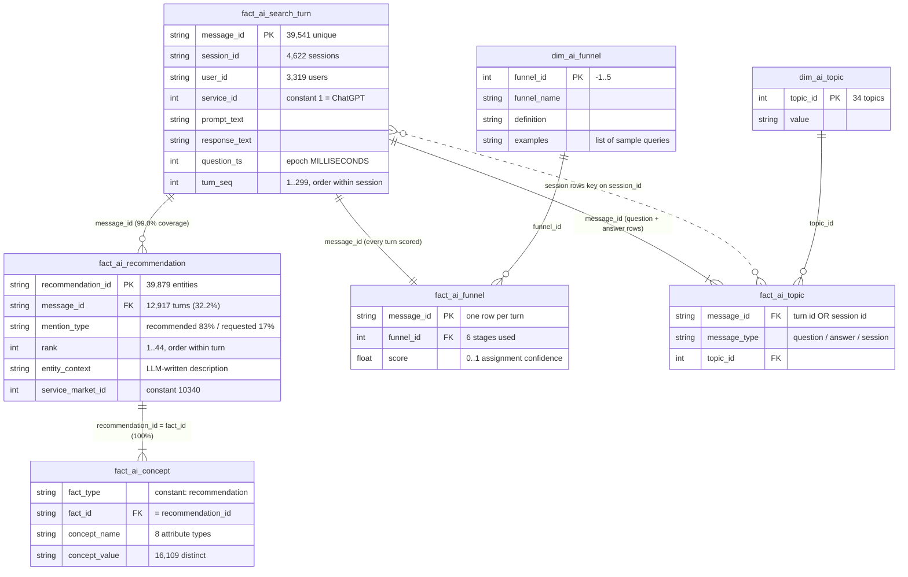
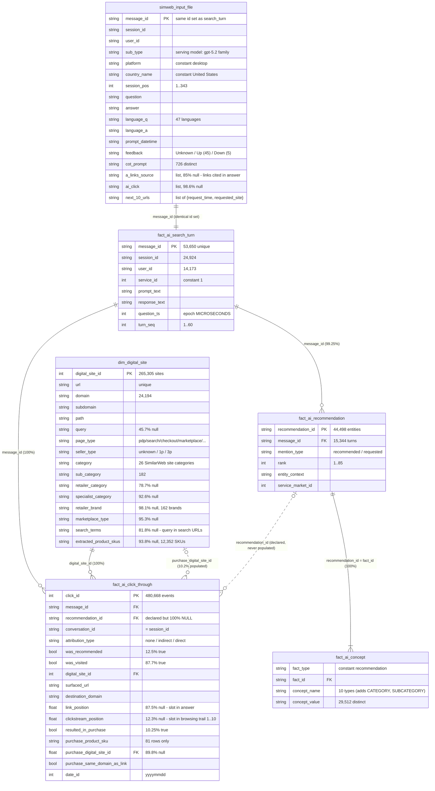

# Data dictionary — SimilarWeb datasets

Detailed schemas, entity-relationship diagrams and field documentation for the
two SimilarWeb extracts used by this project. All figures below come from the
executed profiling notebooks — regenerate them by re-running:

| Dataset (path) | Profiling notebook | Contents |
|---|---|---|
| `data/similarweb_transformed_data/` | [`notebooks/02_similarweb_star_schema.ipynb`](../notebooks/02_similarweb_star_schema.ipynb) | *Analytical* view: turns + extracted entities + concepts + **funnel stages** + **topics** |
| `data/similarweb_clickstream_data/` | [`clickstream_data_analysis.ipynb`](../clickstream_data_analysis.ipynb) | *Behavioral* view: turns + entities + concepts + **click-throughs / visits / purchases** + destination-site catalog + raw input |

Both are ChatGPT skincare activity, **US, desktop, January 2026** (2026-01-01 →
2026-02-01). They share three table schemas but are **different samples** —
only ~9% of `message_id`s overlap. Data files are not versioned
(`.gitignore`); place the parquet folders under `data/`.

---

## 1 · `similarweb_transformed_data` — the analytical star schema

**Scale:** 39,541 turns · 4,622 sessions · 3,319 users · single service
(`service_id`=1, ChatGPT) · single market (`service_market_id`=10340) ·
timestamps in Unix epoch **milliseconds**. Turns per session: mean 8.6,
median 4, p99 67, max 299.

### 1.1 ER diagram

### 1.2 Table schemas

#### `fact_ai_search_turn` — 39,541 rows × 8 cols (the spine; grain = one user↔LLM turn)

| column | dtype | null% | n_unique | description |
|---|---|---|---|---|
| `message_id` | str | 0 | 39,541 | **PK.** Turn identifier; everything else hangs off it |
| `session_id` | str | 0 | 4,622 | conversation/session grouping |
| `user_id` | str | 0 | 3,319 | anonymized panel user |
| `service_id` | int64 | 0 | 1 | constant `1` = ChatGPT |
| `prompt_text` | str | 0 | 37,645 | user's message |
| `response_text` | str | 0 | 38,816 | LLM's answer |
| `question_ts` | int64 | 0 | 38,874 | Unix epoch **ms** (⚠ µs in the clickstream dataset) |
| `turn_seq` | int64 | 0 | 299 | position of the turn inside its session |

#### `fact_ai_recommendation` — 39,879 rows × 6 cols (grain = one product entity named in a turn)

| column | dtype | null% | n_unique | description |
|---|---|---|---|---|
| `recommendation_id` | str | 0 | 39,879 | **PK.** One extracted entity mention |
| `message_id` | str | 0 | 12,917 | **FK → search_turn** (99.0%; ~1% orphans). 32.2% of turns have ≥1 entity |
| `mention_type` | str | 0 | 2 | `recommended` 33,266 (LLM-introduced) / `requested` 6,613 (user-named) |
| `rank` | int64 | 0 | 44 | order of appearance within the turn (1 = first; >10 in 4.5% of rows) |
| `entity_context` | str | 0 | 33,516 | LLM-written one-line description of the entity |
| `service_market_id` | int64 | 0 | 1 | constant 10340 |

Entities per turn (turns that have any): mean 3.09, median 2, p90 8, max 44.

#### `fact_ai_concept` — 181,827 rows × 4 cols (grain = one standardized attribute of one entity)

| column | dtype | null% | n_unique | description |
|---|---|---|---|---|
| `fact_type` | str | 0 | 1 | constant `recommendation` |
| `fact_id` | str | 0 | 39,723 | **FK → recommendation.recommendation_id** (100%). ⚠ The vendor data dictionary says `message_id` — that is wrong (0% coverage); always join through the recommendation |
| `concept_name` | str | 0 | 8 | attribute type (below) |
| `concept_value` | str | 0 | 16,109 | attribute value (upper-cased) |

Concepts per entity: mean 4.58, max 8. `concept_name` counts:
`APPLICATION_AREA` 38,545 · `FORM` 35,403 · `BRAND` 22,485 ·
`FORMULATION_DESCRIPTORCLAIM` 19,435 ·
`STRATEGIC_INGREDIENT_PRESENCEABSENCE_CLAIM` 19,287 ·
`TARGET_SKIN_CONCERNCONDITION` 17,891 · `SUB_BRAND` 16,287 ·
`TARGET_SKIN_AUDIENCE` 12,494. Top `BRAND` values: CERAVE 2,148 ·
THE ORDINARY 1,326 · LA ROCHE-POSAY 1,154.

#### `dim_ai_funnel` — 7 rows × 4 cols (stage definitions)

| `funnel_id` | `funnel_name` | definition (abridged) |
|---|---|---|
| -1 | Irrelevant | not product-related (software help, homework, general chat) — **defined but never assigned in this sample** |
| 0 | Awareness | notices a problem/need, not yet product-thinking; "WHY" questions |
| 1 | Discovery | problem named; explores categories/ingredients/routines; generic, non-branded |
| 2 | Evaluation | active consideration of specific products/brands; comparisons, suitability, tradeoffs |
| 3 | Intent | choice narrowed, high readiness: where to buy, best price, availability |
| 4 | Purchase | executing/confirming a transaction (buying, add-to-cart, order confirmation) |
| 5 | Post-Purchase | usage, optimization, repeat behaviour: how to use/layer, expected results |

`examples` holds sample queries per stage (list column).

#### `fact_ai_funnel` — 39,541 rows × 3 cols (grain = one stage assignment per turn; full coverage)

| column | dtype | null% | n_unique | description |
|---|---|---|---|---|
| `message_id` | str | 0 | 39,541 | **PK/FK → search_turn** (1:1, 100%) |
| `funnel_id` | int64 | 0 | 6 | assigned stage (one per turn — *not* a score per stage) |
| `score` | float64 | 0 | 38,612 | assignment confidence 0–1 (means ≈ 0.22–0.28 by stage) |

Stage distribution: Intent 27.5% · Purchase 19.6% · Awareness 18.9% ·
Post-Purchase 17.3% · Discovery 8.9% · Evaluation 7.8%.

#### `dim_ai_topic` — 34 rows × 2 cols / `fact_ai_topic` — 83,704 rows × 3 cols

| column | dtype | null% | n_unique | description |
|---|---|---|---|---|
| `topic_id` | int64 | 0 | 34 | **PK** in dim; FK in fact |
| `value` | str | 0 | 34 | topic label (contains raw typos: "fitnes", "sinusiti") |
| `message_id` | str | 0 | 44,163 | ⚠ **overloaded key**: for `message_type` ∈ {question, answer} it is the turn id; for `session` it holds the **session_id** |
| `message_type` | str | 0 | 3 | scope: `question` 39,541 · `answer` 39,541 · `session` 4,622 |

Every turn gets one question-topic and one answer-topic; every session one
session-topic. Top topics: "seeking quick feedback" 10,710 · "personalized
acne skincare routine" 9,785 · "actionable step by step advice" 9,143.

### 1.3 Join integrity (computed)

| foreign key | coverage |
|---|---|
| recommendation.message_id → search_turn.message_id | **0.9903** (~1% orphan entities) |
| concept.fact_id → recommendation.recommendation_id | **1.0000** |
| concept.fact_id → recommendation.message_id (vendor doc's claim) | **0.0000** (doc is wrong) |
| funnel.message_id → search_turn.message_id | **1.0000** |
| topic[question].message_id → search_turn.message_id | **1.0000** |
| topic[session].message_id → search_turn.session_id | **1.0000** |

---

## 2 · `similarweb_clickstream_data` — the behavioral / attribution view

**Scale:** 53,650 turns · 24,924 sessions · 14,173 users · 480,668 surfaced
links · 265,305 distinct sites · 32 `date_id` days (20260101–20260201) ·
timestamps in Unix epoch **microseconds** (16-digit — ⚠ different unit than
the transformed dataset). Raw input is **multilingual** (47 languages; 79% en)
and records the serving model (`sub_type`: gpt-5.2 73.7%, gpt-5-mini 14.1%,
gpt-5.2-thinking 4.6%, …).

### 2.1 ER diagram

### 2.2 Table schemas (tables unique to this dataset)

#### `fact_ai_click_through` — 480,668 rows × 17 cols ⭐ (grain = one link surfaced to the user)

| column | dtype | null% | n_unique | description |
|---|---|---|---|---|
| `click_id` | int64 | 0 | 480,668 | **PK** |
| `message_id` | str | 0 | 53,650 | **FK → search_turn** (100%) — clicks attach to the *turn* |
| `recommendation_id` | object | **100** | 0 | declared FK to the recommended entity — **never populated**; attribute AI clicks via `message_id` + `was_recommended` |
| `conversation_id` | str | 0 | 24,924 | session id (same values as `session_id`) |
| `attribution_type` | str | 0 | 3 | purchase attribution to the AI rec: `none` 413,794 · `indirect` 65,716 · `direct` 1,158 |
| `was_recommended` | bool | 0 | 2 | link came from the AI answer (12.5% true) |
| `was_visited` | bool | 0 | 2 | user actually went there (87.7% true; see §2.4 caveat) |
| `digital_site_id` | int64 | 0 | 265,305 | **FK → dim_digital_site** (100%) |
| `surfaced_url` | str | 0 | 265,305 | the link itself (denormalized copy of `dim_digital_site.url`) |
| `destination_domain` | str | 0 | 24,194 | denormalized domain |
| `link_position` | float64 | 87.5 | 47 | slot of the link inside the AI answer (0..46) — only for AI-surfaced links |
| `clickstream_position` | float64 | 12.3 | 10 | slot in the user's post-turn browsing trail (1..10, from `next_10_urls`) |
| `resulted_in_purchase` | bool | 0 | 2 | a purchase followed this link (10.25% true) |
| `purchase_product_sku` | str | ~100 | 7 | SKU of the purchased product — only 81 rows populated |
| `purchase_digital_site_id` | float64 | 89.8 | 1,250 | **FK → dim_digital_site** of the purchase page (populated on purchase rows) |
| `purchase_same_domain_as_link` | bool | 0 | 2 | purchase happened on the surfaced link's own domain |
| `date_id` | int64 | 0 | 32 | day key `yyyymmdd` |

Headline funnel (this table, Jan 2026): 480,668 surfaced → 12.5%
AI-recommended → 87.7% visited → 10.25% purchase-flagged; purchase rate given
visited = 9.35%. Top purchase domains: amazon.com 17,098 · google.com 3,452 ·
chatgpt.com 2,118 · walmart.com 1,468 · target.com 986 · sephora.com 712.

#### `dim_digital_site` — 265,305 rows × 16 cols (grain = one URL)

| column | dtype | null% | n_unique | description |
|---|---|---|---|---|
| `digital_site_id` | int64 | 0 | 265,305 | **PK** |
| `url` | str | 0 | 265,305 | full URL (unique) |
| `domain` | str | 0 | 24,194 | registrable domain |
| `subdomain` | str | 0 | 4,834 | |
| `path` | str | 0 | 159,448 | |
| `query` | str | 45.7 | 123,219 | raw query string |
| `page_type` | str | 0 | 8 | journey role: `other` 158,928 · `search` 46,043 · `pdp` 43,155 · `marketplace` 6,754 · `category` 6,447 · `checkout` 2,655 · `retailer_site` 1,120 · `brand_site` 203 |
| `seller_type` | str | 0 | 3 | `unknown` 252,765 · `1p` 7,675 · `3p` 4,865 |
| `category` | str | 6.4 | 26 | SimilarWeb site category (top: Computers_Electronics 85,537 · E-commerce_and_Shopping 34,110) |
| `sub_category` | str | 16.5 | 182 | |
| `retailer_category` | str | 78.7 | 4 | |
| `specialist_category` | str | 92.6 | 13 | |
| `retailer_brand` | str | 98.1 | 162 | retailer brand when identified |
| `marketplace_type` | str | 95.3 | 2 | |
| `search_terms` | str | 81.8 | 33,831 | query extracted from search-engine URLs |
| `extracted_product_skus` | str | 93.8 | 12,352 | SKU(s) parsed from PDP URLs |

Note: many columns encode missing as the *string* `"None"` — normalise before
counting (the notebook's `as_missing` helper does this).

#### `simweb_input_file` — 53,650 rows × 22 cols (grain = one raw turn, pre-transformation)

| column | dtype | null% | n_unique | description |
|---|---|---|---|---|
| `type` | str | 0 | 1 | constant (export type) |
| `sub_type` | str | 0 | 14 | **serving model**: gpt-5.2 39,514 · gpt-5-mini 7,549 · gpt-5.2-thinking 2,480 · gpt-5 1,771 · gpt-5.2-instant 1,167 · gpt-4o 655 · … |
| `platform` | str | 0 | 1 | constant `desktop` (the panel's blind spot — see research Q4) |
| `country` / `country_name` | int32/str | 0 | 1 | constant United States |
| `session_id` / `user_id` / `message_id` | str | 0 | 24,924 / 14,173 / 53,650 | same id space as `fact_ai_search_turn` (identical `message_id` set) |
| `session_pos` | int32 | 0 | 343 | turn position in session |
| `question` / `answer` | str | 0 | 52,416 / 53,640 | raw text (multilingual) |
| `language_q` / `language_a` | str | 0 | 47 | detected language (en 42,401 · zh-cn 2,285 · es 946 · ko 901 · …) |
| `prompt_datetime` / `prompt_date` | str | 0 | 52,954 / 31 | timestamp / date |
| `feedback` | str | 0 | 3 | user thumbs: Unknown 53,600 · Up 45 · Down 5 |
| `cot_prompt` | str | 0 | 726 | reasoning/system prompt variant captured with the turn |
| `a_links_source` | object (list) | 85.0 | — | links cited in the answer |
| `ai_click` | object (list) | 98.6 | — | clicks on AI-answer links captured client-side |
| `next_10_urls` | object (list) | 0 | — | **the raw browsing trail**: up to 10 `{request_time, requested_site}` entries after the turn — the source `fact_ai_click_through` is built from |
| `year` / `month` | int32 | 0 | 1 | constant 2026 / 1 |

#### Shared tables, this sample

`fact_ai_search_turn` 53,650×8 (µs timestamps) ·
`fact_ai_recommendation` 44,498×6 (rank 1..85; recommended 37,986 / requested
6,512; 15,344 turns with entities) · `fact_ai_concept` 292,485×4 with **10**
concept types — adds `CATEGORY` and `SUBCATEGORY` (44,498 each = every entity
gets both), the other 8 as in §1.2.

### 2.3 Join integrity (computed)

| foreign key | coverage |
|---|---|
| click_through.message_id → search_turn.message_id | **1.0000** |
| click_through.digital_site_id → dim_digital_site.digital_site_id | **1.0000** |
| click_through.recommendation_id populated | **0.0000** |
| concept.fact_id → recommendation.recommendation_id | **1.0000** |
| recommendation.message_id → search_turn.message_id | **0.9925** |
| input_file.message_id ≡ search_turn.message_id (same set) | **1.0000** |

### 2.4 Interpretation caveats (important)

- **`was_visited` is not a CTR.** Organic rows enter the log *from the
  browsing trail* (`next_10_urls`), so they are visited by construction
  (visit rate | organic = 100%); AI-recommended links are surfaced from the
  answer and mostly not clicked (visit rate | AI link = **2.0%**). Compute
  funnel rates *within* `was_recommended` strata, never pooled.
- **Attribution is turn-level, not entity-level:** `recommendation_id` is
  never populated — you can say "a purchase followed a turn whose answer
  recommended brand X", not "this click came from entity #3". Entity-level
  linkage requires matching `destination_domain`/SKU against the turn's
  recommended brands (what `conveyer.graphs` does).
- **`attribution_type`**: `direct` (purchase on the recommended link's own
  path) is rare — 1,158 events (0.24%); `indirect` 65,716 (13.7%). This
  operationalizes the direct/indirect split of research question Q2.
- **Timestamp units differ across datasets**: µs here, ms in the transformed
  set — convert with `unit="us"` / `unit="ms"` respectively before any join
  or time analysis.
- **`purchase_product_sku` is ~empty** (81 rows). SKU-level purchase analysis
  must go through `purchase_digital_site_id` → `dim_digital_site.extracted_product_skus`.

---

## 3 · The two datasets side by side

| | `similarweb_transformed_data` | `similarweb_clickstream_data` |
|---|---|---|
| Purpose | *what the AI said* + funnel/topic classification | *what the user did next* (visit/purchase attribution) |
| Tables | 7 | 6 |
| Unique tables | `dim_ai_funnel`, `fact_ai_funnel`, `dim_ai_topic`, `fact_ai_topic` | `fact_ai_click_through`, `dim_digital_site`, `simweb_input_file` |
| Shared schemas | `fact_ai_search_turn`, `fact_ai_recommendation`, `fact_ai_concept` (different samples; ~9% turn overlap) | idem |
| Scale | 39,541 turns / 4,622 sessions / 3,319 users | 53,650 turns / 24,924 sessions / 14,173 users |
| Sessions | long (mean 8.6 turns, max 299) | short (mean 2.2 turns, max 60) |
| Language | English-centric | 47 languages (79% en) |
| Serving model | not recorded | `sub_type` (gpt-5.2 family) |
| `question_ts` unit | **milliseconds** | **microseconds** |
| Concept types | 8 | 10 (adds `CATEGORY`, `SUBCATEGORY`) |
| `rank` max | 44 | 85 |
| Funnel stage / topics | ✅ | ❌ |
| Clicks / visits / purchases | ❌ | ✅ |

**How they combine in the pipeline** (see
[PIPELINE_AND_HYPOTHESES.md](PIPELINE_AND_HYPOTHESES.md)): the transformed set
supervises the journey HMM's emissions (funnel stages) and feeds the utility
model (`rank`); the clickstream set provides the `clicked` edges of the
interaction graph, the second emission channel of the HMM, and the
trials/successes of the conversion posteriors (Q3). The ~9% `message_id`
overlap means they are joined at the *model* level (shared schemas +
poststratification), not row-by-row.

---

## 4 · Derived dataset — scraped pages (`conveyer.pages` → `outputs/scraped/`)

The URLs in the clickstream tables (`surfaced_url`, `dim_digital_site.url`,
`next_10_urls`, `a_links_source`) are scraped, classified and product-parsed
by [`conveyer/pages.py`](../conveyer/pages.py) (CLI:
`python -m conveyer.pages --urls <file> --url-col url --out outputs/scraped`).
The fetcher honours robots.txt, rate-limits per domain and caches HTML, so
re-runs are incremental.

### 4.1 Page taxonomy (funnel-aware)

| `page_class` | Maps to funnel stage | Examples / signals |
|---|---|---|
| `brand_landing` | Discovery | brand-owned domain root, `Organization`/`WebSite` JSON-LD |
| `catalogue_page` | Discovery | `ItemList`/`CollectionPage`, product grids, /collections/ paths |
| `search_results` | Discovery | search engines, `?q=` site search |
| `review_editorial` | Evaluation | `Article` JSON-LD, "best X / review / vs" titles + long text |
| `forum_social` | Evaluation | reddit, youtube, tiktok, instagram, quora |
| `product_page` | Intent | single `Product` JSON-LD with offer, add-to-cart + /product/ URL |
| `checkout_or_cart` | Purchase | /cart, /checkout URLs and titles |
| `ai_assistant` | — | chatgpt.com, perplexity.ai (the chat itself) |
| `unrelated` | — | none of the above |

`ownership` further splits shopping pages into `brand_owned` / `retailer` /
`marketplace` / `unknown` (brand-domain match against the chat's brand
lexicon + curated retailer/marketplace lists). Every label ships with
`class_confidence` and a `class_evidence` trail.

### 4.2 `scraped_pages.parquet` (grain = one URL)

`page_id` (sha1-16 of url, PK) · `url` · `final_url` · `domain` · `fetched_at`
· `http_status` · `fetch_error` · `content_type` · `page_class` ·
`funnel_stage` · `ownership` · `class_confidence` · `class_evidence` · `title`
· `meta_description` · `og_type` · `og_site_name` · `canonical_url` ·
`language` · `h1` · `n_links` · `n_images` · `n_product_links` ·
`n_price_signals` · `has_add_to_cart` · `jsonld_types` · `n_jsonld_products`
· `text_chars` · `text_snippet`

### 4.3 `scraped_products.parquet` (grain = one product found on a page)

`page_id` (FK) · `url` · `message_id` (FK → search_turn, when the URL came
from a turn) · `source` (jsonld / microdata / og_meta) · `name` · `brand` ·
`description` · `price` · `price_currency` · `availability` · `rating_value`
· `rating_count` · `category` · `sku` · `image_url`

### 4.4 `product_entity_matches.parquet` (grain = one product ↔ best chat entity)

`page_id` · `message_id` · `product_name` · `product_brand` ·
`matched_entity` (from `fact_ai_recommendation.entity_context`) ·
`matched_entity_brand` · `name_similarity` (0–1, char-ratio + token-overlap
blend) · `brand_match` (bool) · `coincides` (bool: similarity ≥ 0.55, or
brand match with ≥ 0.35 name support)

This closes the loop the clickstream leaves open (its `recommendation_id` is
never populated): a visited URL whose on-page product `coincides` with a
recommended entity is **entity-level attribution evidence**, and the extracted
price/rating/category feed the Q6 utility model and Q7 conversion GLM with
*real* product metadata instead of synthesized values.

---

## 5 · Gotchas checklist (both datasets)

1. `fact_ai_concept.fact_id` joins to `recommendation_id`, **not** `message_id`
   (vendor doc is wrong).
2. `fact_ai_topic.message_id` is overloaded: session-scoped rows carry
   `session_id`.
3. `question_ts`: ms (transformed) vs µs (clickstream).
4. `click_through.recommendation_id`: 100% null — attribute via
   `message_id` + `was_recommended`.
5. `was_visited` semantics differ by `was_recommended` stratum (§2.4).
6. `dim_digital_site` encodes missing as string `"None"` in several columns.
7. ~1% orphan `fact_ai_recommendation.message_id` in both samples.
8. `Irrelevant (-1)` funnel stage defined but never assigned.
9. `dim_ai_topic.value` contains typos ("fitnes", "sinusiti") — treat as raw labels.
10. `funnel.score` is the confidence of the single assigned stage — there is
    no per-stage score vector.
