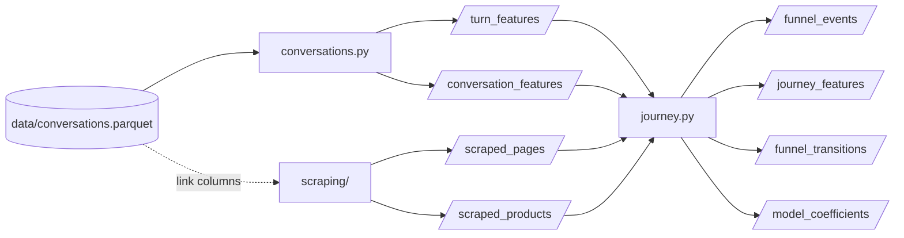

# Data dictionary — input & every output table

One input, seven outputs. All outputs are parquet with **pinned pyarrow
schemas**; regenerate everything with `python -m conveyer.pipeline`.

---

## 0 · Input — `data/conversations.parquet` (grain = one user↔LLM turn)

| column | dtype | description |
|---|---|---|
| `session_id` | str | conversation/session identifier |
| `message_id` | str | unique id for the user/LLM turn |
| `user_id` | str | anonymised panelist identifier |
| `prompt_datetime` | str | prompt timestamp |
| `question` / `answer` | str | user prompt / model response |
| `a_links_source` | list | links surfaced in the response |
| `ai_click` | list | links clicked directly from the AI response |
| `next_10_urls` | list\<struct\> | post-prompt navigation: up to 10 `{request_time (epoch-ms str), requested_site}` |

Loading (`conveyer.ingest.load_conversations`) tolerates numpy-array,
Python-list and stringified-repr link cells, parses timestamps to
`prompt_dt`, and derives `session_pos` (1-based, time-ordered). When the file
is absent, `make_synthetic_conversations` produces the same schema **plus
ground truth** (`gt_archetype`, `gt_followed_rec`, `gt_converted`) and an
offline page corpus, so the full pipeline runs and scores itself.

---

## 1 · Module 1 outputs — `outputs/conversations/`

### `turn_features.parquet` (grain = turn; 25 cols)

| group | columns |
|---|---|
| identity | `message_id` PK · `session_id` · `user_id` · `session_pos` · `prompt_datetime` |
| text | `question` · `answer` |
| intent | `intent` (comparison/purchase/troubleshooting/routine/informational) · `asks_recommendation` |
| sentiment | `question_sentiment` · `answer_sentiment` (−1..1; lexicon or transformers) |
| brands | `brands_q` · `brands_a` · `brands_unsolicited` (agent-introduced — the exposure) · `brands_endorsed` · `n_brands_answer` · `is_recommendation` |
| stages | `funnel_stage` (keyword) · `journey_stage` (HMM-smoothed) |
| topics | `topic_id` · `topic_label` |
| links | `links_cited` · `links_clicked` · `n_links_cited` · `n_ai_clicks` · `n_trail_events` |

### `conversation_features.parquet` (grain = session; 22 cols)

`session_id` PK · `user_id` · `n_turns` · `duration_seconds` · `first_intent` ·
`dominant_intent` · `asks_recommendation_share` · `mean_question_sentiment` ·
`mean_answer_sentiment` · `sentiment_trend` · `brands_discussed` ·
`brands_recommended_unsolicited` · `n_brands_discussed` ·
`n_unsolicited_recommendations` · `any_recommendation` · `n_links_cited` ·
`n_ai_clicks` · `n_trail_events` · `max_funnel_stage_idx` · `max_funnel_stage` ·
`journey_path` (e.g. `Discovery > Evaluation > Intent`) · `topic_label`

---

## 2 · Module 2 outputs — `outputs/scrape/`

`scraped_pages.parquet` (57 cols, grain = URL) and
`scraped_products.parquet` (26 cols, grain = product-on-page), each with a
crash-safe `.jsonl` sidecar. Full column documentation, taxonomy, ER diagram
and caveats: **[SCRAPED_PAGES_SCHEMA.md](SCRAPED_PAGES_SCHEMA.md)**.

---

## 3 · Module 3 outputs — `outputs/journey/`

### `funnel_events.parquet` (grain = one behavioural event; 16 cols)

| column | type | description |
|---|---|---|
| `session_id` / `message_id` | str | which turn produced the event |
| `event_type` | str | `cited` (agent exposure) · `ai_click` (direct click) · `trail_visit` (post-turn navigation) |
| `url` | str | the page |
| `position` | int32 (nullable) | 1-based slot in the trail (trail visits only) |
| `dwell_seconds` | float64 (nullable) | gap to the next request; last event never gets one |
| `page_category` / `page_subtype` / `funnel_stage` / `seller_type` | str | module 2's classification (URL-only fallback ⇒ 100% coverage, see `page_coverage`) |
| `page_brand` | str | canonical brand the page is evidence for (domain, OG, or extracted product brands) |
| `brand_match` | str | vs the turn's mentions: `unsolicited_rec` · `endorsed` · `requested` · `none` |
| `followed_agent_link` | bool | user action on an agent-surfaced link (never true for `cited` rows) |
| `commerce_depth` | int32 | 0 none · 1 shopping page · 2 cart · 3 checkout/order |
| `is_study_relevant` | bool | module 2's topical verdict |
| `page_coverage` | str | `pages` (scraped) or `url_only` (heuristic fallback) |

### `journey_features.parquet` (grain = session; 21 cols) — the model table

| group | columns |
|---|---|
| conversation side | `n_turns` · `asks_recommendation_share` · `mean_question_sentiment` · `mean_answer_sentiment` · `n_unsolicited_recommendations` · `n_links_cited` · `max_funnel_stage_idx` |
| behaviour side | `n_visits` · `n_shopping_visits` · `n_relevant_visits` · `total_dwell_shopping` · `mean_dwell` |
| exposure (treatment) | `followed_agent_link` · `visited_recommended_brand` · `followed_recommendation` (either) |
| outcome (proxy) | `max_commerce_depth` · `reached_shop` · `reached_cart` · `reached_checkout` · `converted` (`≥ JourneyConfig.conversion_stage`, default cart) |

### `funnel_transitions.parquet` (long form)

`from_stage` · `to_stage` · `count` · `prob` — stage sequence = smoothed
conversation stages in turn order, then visited pages' stages in trail order;
`prob` rows sum to 1 per `from_stage`.

### `model_coefficients.parquet`

`feature` · `coef_standardized` · `odds_ratio_per_sd` — the logistic
conversion model on standardized features; the `followed_agent_link` /
`visited_recommended_brand` rows are the headline **weight of agent
recommendations** (see [FUNNEL_MODEL.md](FUNNEL_MODEL.md) for the
identification caveats).

---

## Gotchas checklist

1. `next_10_urls` arrives as **numpy arrays of dicts** from parquet — always
   go through `ingest.as_records` / `trail_events`.
2. The **last trail entry has no dwell** (no successor); dwell includes idle
   time — treat as an upper bound on attention.
3. `converted` is a **proxy** (reaching cart/checkout in the trail), not a
   confirmed purchase.
4. Brand matching runs on the **canonical lexicon** (`conveyer.brands`);
   extend it before analysing a niche brand, or its mentions/pages won't link.
5. Exposure strata are observational — `followed_recommendation` users
   self-select (see FUNNEL_MODEL.md §limitations).
