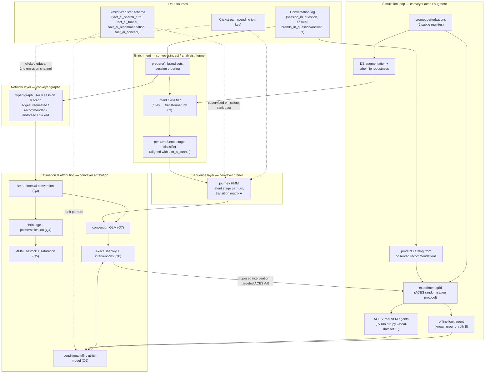
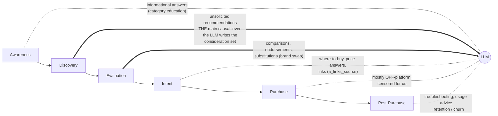
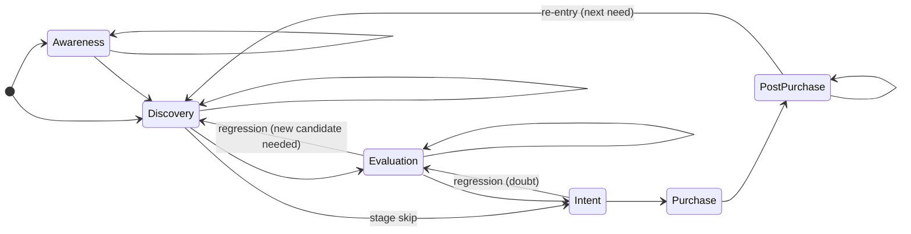

# conveyer — pipeline, hypotheses, and the journey HMM

This is the project wiki: how the final pipeline fits together, the working
hypothesis for each research question, **where the LLM enters the purchase
funnel**, **where each measured feature enters a probability**, and the full
specification of the **journey HMM**.

Companion artifacts: the executable version of everything here is
[`notebooks/04_aces_and_research_questions.ipynb`](../notebooks/04_aces_and_research_questions.ipynb);
the implementation lives in the `conveyer/` package (module names cited
throughout).

---

## 1 · The final pipeline



Reading order of the loop: **observe** (conversations + star schema) →
**infer** (stage, network, conversion) → **simulate** (ACES: what would an
agent buy under counterfactual slates and prompts) → **estimate** (utility,
conversion, attribution) → **intervene** (Shapley-ranked levers) → **verify**
(targeted ACES experiment) → repeat.

Two properties are deliberate:

* **Every estimator is validated by recovery.** The offline logit agent and
  every Q3–Q7 prototype plant known parameters and recover them before any
  real data is attached. Swapping simulator output for real ACES logs or real
  clickstream changes the data source, never the analysis.
* **One vocabulary for prompts.** The same nine perturbation operators define
  the ACES treatment arms *and* the DB augmentation, so simulator findings and
  observational text stay comparable.

---

## 2 · Hypotheses for the research questions

| # | Question | Hypothesis (short form) | Module |
|---|---|---|---|
| Q1 | Infer purchase-journey stage | Stage is a **latent, mostly-forward state**; per-turn text labels are noisy emissions of it → sequence model (HMM), not per-turn classification alone | `funnel` |
| Q2 | Chats + entities + clickstream as a network | A **typed multigraph** makes attribution a path query: direct = `requested/endorsed` edges, indirect = `recommended`-only; `llm_dependence` = share of a brand's exposure the LLM itself creates | `graphs` |
| Q3 | Purchases from clickstream | Not deterministically (checkout is censored) but **reliably with quantified uncertainty**: purchase-proxy URLs as binomial outcomes, Beta-binomial → hierarchical posteriors; the direct-vs-indirect CVR gap *is* the incremental value of a recommendation | `attribution.beta_binomial_posterior` |
| Q4 | Unseen segments (mobile, other LLMs) | **MRP/transportability**: behaviour rates are stable *given journey stage & intent*; segments differ in cell **mix**. Model cells with partial pooling, reweight by the target segment's mix from external panel/survey data; Dirichlet prior on mixes for honest uncertainty | `attribution.shrink_segments`, `poststratify` |
| Q5 | Attribute online/offline sales to LLM recs | LLM exposure is a **marketing channel in a Bayesian MMM** (adstock + saturation) covering online *and* offline sales; identification via calibration: model-release event studies, synthetic control on brands the LLM starts/stops recommending, geo tests → informative priors on the channel coefficient | `attribution.fit_mmm` |
| Q6 | Why LLMs rank products in a given order | Rankings are draws from a latent **utility model** `u = β·(position, price, rating, social proof, badges…)`; conditional/exploded MNL on `fact_ai_recommendation.rank` and on ACES choices; comparing β̂ across prompt arms / model versions / providers explains *why* rankings differ | `attribution.fit_mnl` |
| Q7 | Conversion probability | Hierarchical GLM over three blocks — **user state** (journey stage, intent), **exposure type** (direct/indirect), **product & text semantics** (rating, price, answer sentiment/embeddings) — with block interactions (an enthusiastic rec matters most mid-funnel) | notebook §4.7 |
| Q8 | Shapley → interventions | Choice/conversion probability decomposes exactly into per-feature **interventional Shapley** contributions; the largest φ on an *actionable* feature is the intervention; expected lift is pre-computed by re-scoring and then verified with a targeted ACES A/B | `attribution.exact_shapley` |

Cross-cutting: prompt-sensitivity (§3 of notebook 04) is both a treatment
(ACES arms) and a measurement audit (label-flip rates of our own classifiers
under meaning-preserving rewrites).

---

## 3 · Where the LLM enters the funnel

The LLM is not a neutral search box: it **injects exposure mid-funnel**. The
per-turn data shows most turns in Discovery/Evaluation — exactly the stages
where consideration sets form.



Stage-by-stage role and the measurable event:

| Funnel stage | What the LLM does there | Observable in our data | Modelling consequence |
|---|---|---|---|
| Awareness | educates on the category | `informational` intent turns | raises P(enter Discovery) — a *transition* effect |
| **Discovery** | **creates the consideration set** (unsolicited brands) | `recommended` edges; `is_recommendation` | brand enters the choice set at all: extensive margin |
| **Evaluation** | ranks, compares, endorses, substitutes | `rank`, endorsed/substitution flags (nb 03) | reorders utilities within the set: intensive margin (Q6) |
| Intent | operational purchase help, links | Intent-stage cues, cited sources | hand-off to clickstream; where `clicked` edges attach |
| Purchase | (off-platform) | censored → purchase proxies (Q3) | outcome model, never observed directly |
| Post-Purchase | troubleshooting, routines | Post-Purchase cues, sentiment | feeds retention and the next journey's prior |

So the model "enters the funnel" at **two probability surfaces**:

1. **Transition probabilities** (journey dynamics): a recommendation event at
   stage *Discovery* increases P(Discovery → Evaluation) and shortens dwell
   time — testable as covariate-dependent transitions in the HMM (§5).
2. **Choice probabilities** (within-stage): given the user is Evaluating, the
   LLM's ranking utilities decide *which* brand survives — the MNL layer (Q6).

Conversion (Q7) composes the two: `P(buy brand b) = P(reach Intent) ×
P(b in consideration set) × P(choose b | set) × P(convert | choose)`.

---

## 4 · Where each measured feature enters a probability

Every feature we measure has exactly one primary "port of entry" into the
model stack. This is the map:

| Feature (source) | Enters | Expected effect |
|---|---|---|
| per-turn stage label (keyword/`fact_ai_funnel`) | HMM **emission** B | the noisy observation of latent stage |
| intent (`analysis`/nb 03 transformer) | HMM emission (2nd channel); Q7 GLM user block | `purchase`/`comparison` intent ⇒ deeper stages, higher base CVR |
| recommendation event (`is_recommendation`) | HMM **transition** covariate (IO-HMM, §5.4) | ↑ P(Discovery→Evaluation), ↓ dwell |
| endorsement / substitution flags (nb 03) | transition covariate; Q7 exposure block | endorsement ↑ P(→Intent); substitution reroutes brand-level path |
| user sentiment / frustration (nb 03) | transition covariate | frustration ↑ P(regression to earlier stage / exit) |
| clickstream events (pending) | 2nd HMM emission channel; `clicked` edges (Q2); trials in Q3 | clicks at Intent stage = the conversion denominator |
| exposure type direct/indirect (`graphs`) | Q3 rate split; Q7 exposure block | direct CVR > indirect; the gap = incremental rec value |
| product position in answer/slate (`rank`, `assigned_position`) | Q6 MNL utility | β_position < 0 (position bias) |
| price, rating, rating_count | Q6 MNL utility; Q7 product block | β_logprice < 0, β_rating > 0, β_social > 0 |
| badges: sponsored / overall-pick / low-stock (ACES) | Q6 MNL utility | sponsored ≤ 0, overall-pick > 0, scarcity small + |
| prompt perturbation arm (`aces.PERTURBATIONS`) | **modifies β itself** (utility-modifier layer) | budget ⇒ β_price more negative; skeptical ⇒ β_sponsored more negative; urgent ⇒ β_position more negative |
| answer text semantics (embeddings/sentiment, nb 03) | Q7 text block (+ interaction with stage) | enthusiastic rec ↑ CVR, strongest mid-funnel |
| journey stage posterior (HMM output) | Q7 user block; Q4 cell definition | monotone ↑ base CVR toward Intent/Purchase |
| segment mix (external panel: device, provider) | Q4 poststratification weights | changes the *mix*, not the cell rates (transportability assumption) |
| weekly rec-exposure volume (scaled via Q4) | Q5 MMM regressor (adstock+saturation) | carries over ~weeks, saturates per brand |
| any fitted utility/GLM feature | Q8 Shapley attribution | ranks the actionable levers |

Rule of thumb: **text features → emissions**, **event features → transitions**,
**slate features → choice utilities**, **user-state × exposure × product →
conversion GLM**, **aggregates → MMM**.

---

## 5 · The journey HMM, concretely

Implemented in [`conveyer/funnel.py`](../conveyer/funnel.py) (`DiscreteHMM`,
numpy Baum-Welch/Viterbi; prototype fitted in notebook 04 §4.1).

### 5.1 Structure



* **Latent states** `S = {Awareness, Discovery, Evaluation, Intent, Purchase,
  Post-Purchase}` (optionally +`Irrelevant` as an absorbing noise state — the
  star schema defines it but never assigns it).
* **Observations per turn** `o_t`: today, the per-turn stage classifier label
  (6 symbols). The state is *latent* precisely because this label is noisy.
* **Left-right prior on A**: initialisation favours self-loops and forward
  moves, keeps small backward mass (journeys do regress: Evaluation→Discovery
  when the consideration set fails, Intent→Evaluation on doubt) and allows
  Post-Purchase→Discovery re-entry.

A session decodes like this (real prototype output, notebook 04):

```
turn  question (abridged)                    raw classifier   HMM decoded
1     "what is retinol good for"             Awareness        Awareness
2     "best retinol cream for beginners"     Discovery        Discovery
3     "CeraVe vs The Ordinary retinol"       Evaluation       Evaluation
4     "how does retinol work"                Awareness  ←noise Evaluation   ← smoothed
5     "where can I buy it under $20"         Intent           Intent
```

The raw classifier bounces back to Awareness at turn 4; the HMM keeps the
journey at Evaluation because a return that deep is a priori unlikely and the
neighbouring evidence dominates. **That smoothing, plus the learned transition
matrix A (the funnel's actual dynamics: where users stall, skip, regress), is
the entire point of the HMM over per-turn classification.**

### 5.2 The three probability objects

For states *i, j* and observation symbols *k*:

* `π_i = P(s_1 = i)` — where journeys start (mass on Awareness/Discovery).
* `A_ij = P(s_{t+1} = j | s_t = i)` — the **funnel dynamics**. Diagonal =
  dwell; superdiagonal = progression; `A[Evaluation, Discovery]` = regression;
  `A[·, Purchase]` per stage = the transition the whole business cares about.
* `B_ik = P(o_t = k | s_t = i)` — the **confusion structure of our
  classifier** (or of `fact_ai_funnel` scores when we supervise with them).
  Diagonal-dominant; off-diagonal cells say which stages the text signal
  genuinely confuses (Awareness↔Post-Purchase questions look alike:
  "how do I use retinol").

Fitting: Baum-Welch (EM) over per-session sequences; decoding: Viterbi (hard
path) and forward-backward posteriors `γ_t(i) = P(s_t = i | o_{1:T})` — the
**soft stage assignment that downstream models consume** (Q7 uses `γ` or the
decoded stage as the user-state feature; Q4 uses it to define cells).

### 5.3 Extending emissions: multi-channel observations

Each turn emits more than one signal. With conditional independence given the
state, emissions factorise — this is how the question's "model chats **and
clickstream** as a sequence" lands in one model:

```
P(o_t | s_t) = P(stage_label_t | s_t)      — text channel (today)
             × P(intent_t      | s_t)      — intent channel (nb 03)
             × P(click_event_t | s_t)      — clickstream channel (pending join)
             × P(n_entities_t  | s_t)      — how many products discussed
```

Clickstream symbols (`product_page`, `add_to_cart`, `checkout_url`, `none`)
are extremely informative emissions for Intent/Purchase — the states our text
channel observes worst. That single extension turns the HMM into the joint
chat+clickstream sequence model, with no change to the training algorithm.

### 5.4 Where features move the probabilities: IO-HMM

The upgrade that connects §4's "event features" to the dynamics: make
transitions depend on turn covariates `x_t` (input-output HMM),

```
P(s_{t+1} = j | s_t = i, x_t) = softmax_j( a_ij + w_j · x_t )
x_t = [ is_recommendation, endorsed, substitution, frustration,
        n_unsolicited_brands, cited_sources, … ]
```

Hypothesised (testable) coefficients: a recommendation event raises
Discovery→Evaluation; an endorsement raises Evaluation→Intent; frustration
raises regression/exit. This is *the* quantitative statement of "where the
LLM enters the funnel": **the LLM's actions are the covariates that bend the
transition matrix.**

### 5.5 Estimation roadmap & diagnostics

1. **Now (done):** unsupervised EM, keyword emissions — prototype recovers a
   diagonal-dominant B and forward-biased A on synthetic data.
2. **Next:** supervise B with `fact_ai_funnel` stage scores (they exist for
   every one of the 39,541 turns) — EM keeps A free, B pinned.
3. **Then:** hidden *semi*-Markov (dwell times are not geometric — Evaluation
   lasts longer than one turn) and the IO-HMM covariates of §5.4.
4. **Bayesian port:** the whole model is a ~40-line NumPyro/PyMC model —
   Dirichlet rows for A and B, forward algorithm as a scan; posteriors on
   `A[·, Purchase]` are then business-readable quantities with credible
   intervals.
5. **Diagnostics:** held-out log-likelihood vs the memoryless baseline
   (per-turn classifier alone); posterior predictive checks on session length
   × final stage; stability of A across months and across augmented
   (perturbed-prompt) copies of the same sessions — A should be invariant to
   meaning-preserving rewrites, and §3.3 of notebook 04 measures exactly that.

---

*Related reading: ACES (arXiv:2508.02630) · MRP: Park, Gelman & Bafumi (2004) ·
Bayesian MMM: Jin et al. (2017), PyMC-Marketing · rank-ordered logit: Beggs,
Cardell & Hausman (1981) · IO-HMM: Bengio & Frasconi (1995) · interventional
Shapley: Janzing et al. (2020).*

