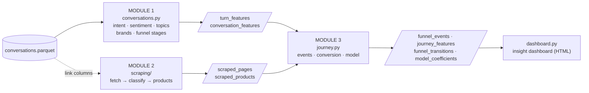
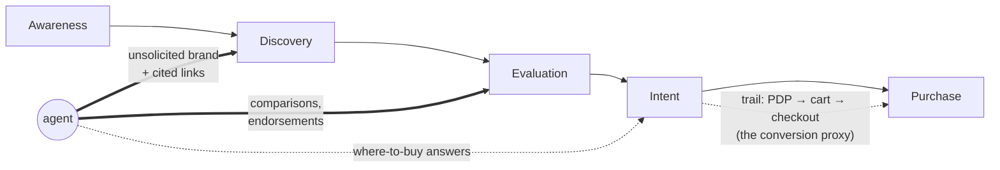

# conveyer — Project Wiki

> **How to edit this page.** This is plain Markdown at `docs/PROJECT_WIKI.md` —
> edit it like any file (GitHub web editor, PR, or locally) and it stays
> versioned with the code. It pastes cleanly into Confluence (*Create → paste*,
> or *Insert → Markup → Markdown*); the diagrams are Mermaid blocks, which
> render on GitHub and in Confluence's Mermaid macros. Keep the changelog at
> the bottom.

| | |
|---|---|
| **Status** | v0.3 — pipeline complete, validated on synthetic ground truth; awaiting real-data run |
| **Input** | one parquet of LLM shopping conversations (schema §4) |
| **Outputs** | 8 parquet tables + an HTML insight dashboard (§8–§9) |
| **Tests** | 33 across four suites, all offline (`python tests/test_*.py`) |
| **Key docs** | [DATA_DICTIONARY](DATA_DICTIONARY.md) · [FUNNEL_MODEL](FUNNEL_MODEL.md) · [SCRAPED_PAGES_SCHEMA](SCRAPED_PAGES_SCHEMA.md) · [STATE_OF_THE_ART](STATE_OF_THE_ART.md) |

---

## 1 · Executive summary

People increasingly shop by *talking to an AI agent* instead of typing
keywords into a search box. The agent answers, names brands, shows links —
and the user then goes somewhere and sometimes buys. **conveyer** measures
that funnel end to end on real conversation logs:

1. **What did the agent say?** — intent, sentiment, topics and, centrally,
   the **brands it recommended unprompted** and the links it cited.
2. **Where did the user actually go?** — every surfaced and visited URL
   classified into funnel roles (catalogue, product page, cart, checkout,
   review, community…), even when the page can't be fetched.
3. **Did it move the needle?** — a session-level **conversion rate** (an
   explicit cart/checkout-reach proxy) and the **weight of agent
   recommendations** on that outcome, estimated with credible intervals and a
   holdout-validated model.

Everything runs **offline first** on a synthetic dataset with planted ground
truth, so the whole machine is testable before real data lands — and the
pipeline scores its own measurement grammar on every synthetic run
(conversion-proxy accuracy 1.0, exposure detection 1.0 in the current build).

## 2 · Why this matters (background)

* LLM referrals to e-commerce are now a real, measurable acquisition channel
  (Kaiser & Schulze 2026, *Marketing Science*).
* Conversational steering is powerful: LLM persuasion nearly **triples**
  sponsored-product selection vs traditional search placement, and users
  rarely notice (Salvi et al. 2026).
* Monetization of answer slots is being designed right now (LLM-native ad
  auctions, ad-injected response benchmarks) — knowing what a recommendation
  is *worth* downstream is the missing number.
* Theory says conversation is an unusually efficient funnel: a few good
  solicitation questions substitute for large assortments (Cao & Hu 2026).

What's missing in the literature is **journey-level measurement on
observational data** — per-session linkage of what the agent said → what the
user visited → whether they reached purchase. That linkage table and its
model are this project's contribution. Full annotated bibliography:
[STATE_OF_THE_ART.md](STATE_OF_THE_ART.md).

## 3 · Objectives & non-goals

**Objectives**

* O1 — quantify the **conversion rate** of agent-mediated shopping journeys,
  with honest uncertainty (credible intervals) and an adjustable definition
  (shop / cart / checkout depth).
* O2 — estimate the **weight of agent recommendations** (brands named,
  links shown) in the buying decision, comparable against every other driver
  (intent, sentiment, journey stage, browsing volume).
* O3 — map journeys onto a **funnel model** (Awareness → Discovery →
  Evaluation → Intent → Purchase → Post-Purchase) covering both what users
  *ask* and where they *land*.

**Non-goals (current phase)**

* Causal identification — the data is observational; coefficients are
  associations (see §10).
* Confirmed purchases — the schema has no order confirmations; conversion is
  a documented proxy.
* Non-skincare verticals — the brand lexicon and taxonomy are tuned to the
  skincare study, though the machinery is generic.

## 4 · The dataset

One parquet, grain = one user↔LLM turn:

| column | meaning |
|---|---|
| `session_id`, `message_id`, `user_id` | identifiers (panel, anonymised) |
| `prompt_datetime` | timestamp of the prompt |
| `question`, `answer` | the turn's text, both sides |
| `a_links_source` | links the answer surfaced |
| `ai_click` | links clicked directly from the answer |
| `next_10_urls` | up to 10 post-turn navigation events `{request_time, requested_site}` |

Semantics worth knowing:

* `next_10_urls` is the **behavioural gold**: order gives the browsing
  sequence; the `request_time` delta to the *next* request is the **dwell** on
  a page (the last event never gets one — no successor to measure against).
* Parquet returns these list columns as **numpy arrays of dicts**; all
  parsing goes through `conveyer.ingest.as_records` / `trail_events`.
* When the file is absent, `conveyer.ingest.make_synthetic_conversations`
  produces the same schema **plus ground truth** (session archetypes:
  converter-via-rec, browser-via-rec, organic converter, no-follow,
  researcher) and an offline page corpus.

## 5 · Architecture



Support layer: `ingest.py` (loading, trail parsing, synthetic GT),
`brands.py` (the canonical brand lexicon both text and domains resolve to),
`funnel.py` (stage taxonomy + a numpy-only HMM), `models.py` (auto-resolving
embedding / sentiment / LLM backends), `schema_utils.py` (typed-arrow parquet
writing).

**Design principles**: offline-first with graceful upgrades (bs4,
sentence-transformers, BERTopic, transformers, Anthropic API are all optional
and auto-detected); pinned pyarrow schemas on every output; honest
measurement with caveats in writing.

## 6 · The three modules

### Module 1 — conversations (*what was said*)

Per turn: **intent** (comparison / purchase / troubleshooting / routine /
informational — transparent rule patterns), **sentiment** for both sides
(skincare-tuned lexicon with negation; upgrades itself to a transformers
pipeline when installed), **topics** (BERTopic when available, else
embeddings + KMeans labelled by distinctive TF-IDF terms), **brand
mentions** via the shared lexicon — split into `requested` (user asked),
`endorsed` (both), and `unsolicited` (**agent-introduced — the exposure
treatment**) — and **funnel stages**: a keyword classifier per turn, smoothed
per session by a discrete HMM (Baum-Welch/Viterbi) so noisy turns don't
zig-zag the journey. Per session: durations, intent mix, sentiment
trajectory, brands discussed/recommended, max stage reached, the collapsed
`journey_path` (e.g. `Awareness > Discovery > Intent`).

### Module 2 — scraping (*where the user landed*)

Every URL from the three link columns is classified into a funnel-mapped
taxonomy — `brand_landing`, `catalogue`, `shopping` (with `seller_type`:
brand-owned vs retailer), `editorial`, `search`, `community`, `reference`,
`unrelated`, `unknown` — by a **multimodal rule scorer**: URL tokens, domain
knowledge, page markup (schema.org / OpenGraph), and any vendor prior each
vote; any one can carry a page alone. The **fallback chain** guarantees
coverage:

1. fetch the page itself (`fetch_scope="page"`);
2. if unreachable, fetch the **base URL** — `x.com/…/status/…` → `x.com/` —
   and classify from base content + the original URL's tokens (`"base"`);
3. else URL + domain heuristics alone (`"none"`) — an unfetchable
   `amazon.com/gp/cart/view.html?ref_=nav_cart` still reads
   `shopping · cart · retailer · Purchase`.

Product metadata (name, brand, price, rating, SKU) is extracted from
schema.org/OG/microdata and matched back to the chat's brand mentions
(`coincides`). Operationally the scraper is built for 100k+ URL runs: obeys
robots.txt (with bounded timeouts), per-domain rate limiting that never
blocks other domains, a hard wall-clock cap per URL, caching, and
line-by-line JSONL persistence with resume — interrupt any time, rerun, it
continues.

### Module 3 — journey (*did it move the needle*)

Normalises behaviour into **events** — `cited` (exposure), `ai_click`,
`trail_visit` (with position + dwell) — each joined to its page
classification (URL-only fallback ⇒ 100% coverage) and tied back to the
conversation two ways: **link identity** (visited a URL the answer cited)
and **brand identity** (`brand_match`: the page's brand — domain, OG tag, or
extracted product brands — against the turn's mention sets;
`unsolicited_rec` is the treatment). Then, per session: the **conversion
proxy** (`max_commerce_depth` ≥ configured stage), exposure flags, and the
model table. Metrics: stratified conversion with **Jeffreys 95% intervals**
and lift; a **funnel transition matrix** (conversation stages then page
stages); and **two logistic models** — the *exposure model* (no
post-treatment mediators: its exposure coefficients are the headline weight)
and the *full model* (adds browsing volume/dwell; best AUC, used to predict,
not to interpret). Rationale for the split: visit counts are *consequences*
of following a recommendation; controlling for them absorbs the effect
(mediator trap).

## 7 · The funnel model in one picture



Exposure definitions: `followed_agent_link` (clicked or trail-visited a cited
URL) · `visited_recommended_brand` (visited a page whose brand the agent
introduced) · `followed_recommendation` = either. Outcome:
`converted = reached cart` by default (`shopping`/`checkout` selectable).

## 8 · Output data model

Eight parquet tables, every schema pinned
([DATA_DICTIONARY.md](DATA_DICTIONARY.md) has each column):

| table | grain | headline columns |
|---|---|---|
| `turn_features` | turn | intent, sentiments, brand sets, funnel/journey stage, topic, link counts |
| `conversation_features` | session | journey_path, max stage, unsolicited recs, sentiment trend |
| `scraped_pages` | URL | category/subtype/seller/funnel stage, fetch_scope, signals, dwell |
| `scraped_products` | product | price, rating, brand, `coincides` with the chat |
| `funnel_events` | event | type, page classification, brand_match, dwell, commerce_depth |
| `journey_features` | session | features + exposure flags + outcome (the model table) |
| `funnel_transitions` | stage-pair | count, row-normalised prob |
| `model_coefficients` | feature × model | standardized coef, odds ratio per SD |

## 9 · The insight dashboard

`conveyer.dashboard` renders the objectives onto one **self-contained HTML
page** (inline charts, no JS, no external requests — attach it to Confluence
or email it):

* KPI tiles: sessions, turns, conversion (with CI), **lift when following
  the agent**, exposure share, pages classified, model AUC;
* conversion by exposure with credible intervals; the behavioural funnel
  (visit → shop → cart → checkout); the exposure-model weights with the
  treatment bars highlighted;
* the **recommended-brand leaderboard** (recommended → visited → followed →
  conversion rate when recommended);
* journey shape: stages, intents, page categories, dwell by category, brand
  match mix.

```bash
python -m conveyer.pipeline --dashboard        # run everything + dashboard
python -m conveyer.dashboard --outputs outputs # rebuild from saved parquets
```

## 10 · How to run

```bash
pip install -r requirements.txt

python -m conveyer.pipeline                                   # offline synthetic + self-validation
python -m conveyer.pipeline --data data/conversations.parquet --online --dashboard
python -m conveyer.scraping --clickstream-dir data/conversations.parquet --online   # module 2 alone
python tests/test_scraping.py  # …_conversations, _journey, _dashboard
```

Notebooks (committed executed): `01_funnel_pipeline.ipynb` (the whole story),
`02_page_classifier.ipynb` (module 2 deep dive). Regenerate with
`python notebooks/_build_notebook_0*.py --execute`.

## 11 · Quality & validation

* **33 offline tests**: scraping 19 (incl. a local dribbling-server proof
  that no URL can hang the run, JSONL resume after a torn file, URL-only
  classification of carts, base-URL fallback), conversations 7, journey +
  end-to-end 5, dashboard 2.
* **Synthetic ground truth**: archetype generation → pipeline → recovery
  check on every run (conversion accuracy, exposure detection, positive
  lift, positive exposure coefficient).
* Every long-running path is incremental and resumable; every output is
  schema-pinned.

## 12 · Limitations & ethics (read before quoting numbers)

* **Association ≠ causation** — users self-select into following
  recommendations; treat the exposure weight as an upper bound. Causal
  claims need randomisation (roadmap).
* **Proxy outcome** — cart/checkout-reach, not confirmed purchase; the
  10-event trail truncates journeys; cross-device purchases are invisible
  (identity fragmentation, Lin & Misra 2022).
* **Lexicon coverage** — brands outside `conveyer/brands.py` won't link;
  extend it before analysing a niche brand.
* **Privacy** — panel data is anonymised; browsing trails are sensitive
  (ad-stream profiling, Chen et al. 2025) — keep outputs aggregate.
* **Scraping etiquette** — robots.txt respected, rate-limited, cached,
  identified user-agent; scraped content is used only for page-role
  classification and product metadata.

## 13 · Roadmap

| horizon | item |
|---|---|
| near | run on the real conversations parquet; calibrate the classifier on a hand-labelled URL sample |
| near | per-brand random effects in the conversion model once volume allows |
| mid | covariate-dependent HMM transitions (does a recommendation shift P(Discovery→Evaluation)?) |
| mid | order-confirmation page patterns to tighten the conversion proxy |
| far | randomised exposure (agent-side A/B or simulator) for causal identification |

## 14 · Glossary

| term | meaning |
|---|---|
| **unsolicited recommendation** | brand the agent named that the user hadn't mentioned — the exposure treatment |
| **endorsed / requested** | brand named by both / only by the user |
| **trail / dwell** | the `next_10_urls` sequence / seconds until the next request |
| **commerce depth** | 0 none · 1 shopping page · 2 cart · 3 checkout/order |
| **conversion (proxy)** | session reached the configured depth in its trail |
| **exposure model vs full model** | without vs with post-treatment mediators (browsing volume, dwell) |
| **fetch_scope** | where page content came from: `page`, `base` (base-URL fallback), `none` |
| **topic-neutral subtype** | page role that carries no topical tokens by nature (cart, checkout, SERP…) — never demoted for lacking skincare words |

## 15 · FAQ

**Why is a page `unknown`?** Nothing earned a structural role: unreachable,
unknown domain, and no URL tokens. It's an honest "can't tell", distinct from
`unrelated` (confidently off-topic, needs evidence).

**Why didn't my brand link up?** Add it to `conveyer/brands.py` (aliases +
domains). One entry fixes text mentions, domain matching and the leaderboard
at once.

**A scrape run died mid-way — did I lose it?** No. Rerun the same command;
the JSONL sidecar resumes, finished pages aren't re-fetched.

**Can I change what counts as conversion?** `JourneyConfig(conversion_stage=
"shopping"|"cart"|"checkout")` or `--conversion-stage` on the CLI.

**Why two models?** See §6/module 3 — mediators absorb the exposure effect;
the exposure model is for interpretation, the full model for prediction.

## 16 · References

Key: Kaiser & Schulze 2026 (*Mark. Sci.*) · Salvi et al. 2026 · Cao & Hu
2026 · Wu & Bao 2025 · Li et al. 2016 (*Mark. Sci.*) · Lin & Misra 2022
(*Mark. Sci.*). Annotated review: [STATE_OF_THE_ART.md](STATE_OF_THE_ART.md);
BibTeX: [references.bib](references.bib).

---

## Changelog

| date | change | author |
|---|---|---|
| 2026-07-22 | v0.3 wiki created: three-module architecture, funnel model, dashboard | Claude (session) |
| | *add yours here* | |
