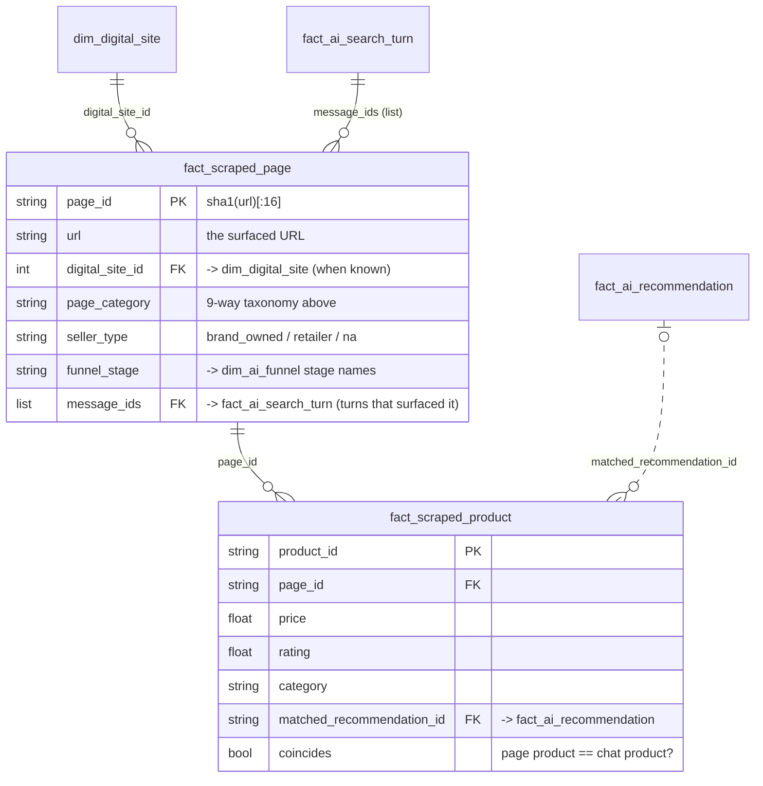

# Schema — scraped surfaced pages (`conveyer.scraping`, module 2)

Every URL surfaced during the conversations — the `a_links_source` /
`ai_click` / `next_10_urls` columns of the conversations parquet (see
[`DATA_DICTIONARY.md`](DATA_DICTIONARY.md) §0) — scraped, classified into
funnel-mapped page categories, with the products found on each page extracted
and matched back to the brands the agent mentioned in the chat.

Produced as a **two-table parquet star**:

| File (default path) | Grain | Rows come from |
|---|---|---|
| `outputs/scrape/scraped_pages.parquet` (`fact_scraped_page`) | one **URL** | the conversation link columns: `a_links_source` ∪ `ai_click` ∪ `next_10_urls` (plus the SimilarWeb star-schema tables when a directory of them is pointed at) |
| `outputs/scrape/scraped_products.parquet` (`fact_scraped_product`) | one **product found on a page** | schema.org `Product` JSON-LD → OpenGraph `product:*` → microdata → visible-price heuristic |

Each parquet has a **`.jsonl` sidecar** (same basename): the pipeline appends
one line per record *the moment a page finishes* (products first, then the
page line as the commit marker). Every `checkpoint_every` pages the in-memory
buffer is flushed to a parquet **part file** (`scraped_pages_parts/part-*.parquet`
— readable mid-run as a dataset directory) and cleared, so memory stays
bounded for arbitrarily long runs; on exit the parts are streamed into the
final single-file parquet. With `resume=True` (default) a re-run skips
everything already in the sidecar. A crash or Ctrl-C loses at most the page
in flight. Raw HTML lives one-file-per-URL in the fetch cache; each page row's
`html_path` points at its file.

`run_manifest.json` sits beside them recording what the table was built from
(input path/size/mtime or synthetic size/seed, plus `max_urls` / `dedupe_by` /
`only_recommended` / `offline`), so a resumed run can tell whether it is the
same run continuing or a different input about to be merged in — see
`conveyer.scraping.resume.prepare_run`.

Regenerate with `python -m conveyer.scraping` (offline synthetic corpus) or,
online, from the star-schema directory **or the raw input file alone**:

```bash
python -m conveyer.scraping --clickstream-dir data/conversations.parquet \
    --online --max-urls 2000 --hard-timeout 30
```

Demo + profiling:
[`notebooks/02_page_classifier.ipynb`](../notebooks/02_page_classifier.ipynb).

---

## 1 · Page taxonomy

The classifier answers three questions per page, kept as **orthogonal axes** so
the headline label stays simple:

1. **`page_category`** — what the page *is* (the discovery/shopping/unrelated
   split requested, plus four proposed additions the data makes unavoidable);
2. **`seller_type`** — for commerce pages, who owns the storefront
   (*external retailer* vs *brand owned* — the requested split, lifted out of
   the category);
3. **`funnel_stage`** — the `dim_ai_funnel` stage the page role maps to, so
   pages plug straight into the journey model (`conveyer.funnel`).

| `page_category` | Funnel stage | Definition | Origin |
|---|---|---|---|
| `brand_landing` | Discovery | Brand homepage or campaign/landing page — introduces the brand, nothing specific to buy | requested |
| `catalogue` | Discovery | Category / collection / listing page showing many products | requested |
| `shopping` | Intent (Purchase for cart/checkout subtypes) | Transactional page for a specific product: PDP, cart, checkout | requested |
| `editorial` | Evaluation | Reviews, "best X for Y" listicles, buying guides, blogs | **proposed** |
| `search` | Intent | Search-engine SERP or on-site search results | **proposed** |
| `community` | Evaluation | Forums / social / UGC: reddit, youtube, Q&A, review communities | **proposed** |
| `reference` | Awareness | Encyclopedic / medical / how-to pages (wikipedia, .gov/.edu) | **proposed** |
| `unrelated` | Irrelevant | Confidently off-topic for the skincare-shopping study | requested |
| `unknown` | Irrelevant | Fetch failed, or too little signal to decide | escape hatch |

Why the proposed four: the vendor's own `dim_digital_site.page_type`
distribution (search 46k · marketplace 6.7k · category 6.4k rows) plus the
editorial/community pages that dominate skincare discovery don't fit the three
requested buckets, and each occupies a distinct funnel position.

**The classifier is multimodal, with a fallback chain.** Five independent
evidence channels vote — URL tokens (`/cart/`, `checkout`, `/dp/…`, `?q=`),
domain knowledge (curated retailer / search / community / editorial /
reference / brand lists, brand domains from `conveyer.brands`), page content &
markup (schema.org, OpenGraph, price/cart signals), the vendor prior when
present, and the **domain directory** (`conveyer/scraping/directory.py`: a
role + description per known domain, extensible via
`ScrapeConfig.directory_path`) — and **any one can carry a page alone**. When
the page itself is unreachable, the fetcher falls back to the **base URL**
(`scheme://host/`, `fetch_scope="base"`) so domain-level content still informs
relevance; when that fails too (robots_blocked, bot walls, dead hosts) the
directory's **description of the domain stands in as content**
(`fetch_scope="directory"`); with no directory entry either, URL + domain
heuristics decide alone (`fetch_scope="none"`).
`classification_signals` records which modalities fired. So
`amazon.com/gp/cart/view.html?ref_=nav_cart` classifies as
`shopping · cart · retailer · Purchase` with zero fetched content: the domain
says retailer, the path says cart. Products are only ever extracted from the
page itself — a base page's markup is never attributed to the deep link.

**Topical relevance is a separate judgement from page structure**, with
collapse rules that respect what each modality can know:

* **topic-neutral subtypes** (cart, checkout, order, SERP, marketplace /
  storefront entry) carry no topical tokens by nature — journey
  infrastructure, never demoted for lacking skincare evidence. Neutrality
  must be **earned** by a structural vote (URL tokens, markup, the vendor
  prior, or a decisive domain role) — the weak retailer catch-all vote does
  not qualify, so `sephora.com/careers` or `amazon.com/prime` stay `unknown`
  rather than becoming "relevant catalogue" pages. A SERP whose URL exposes
  its query is judged by the query text instead (`q=best+retinol` is
  relevant, `q=gaming+laptops` is not);
* **transactional URL tokens are self-evident commerce** on *any* domain: an
  unfetchable `/checkouts/c/<token>` on an unheard-of Shopify store is still
  `shopping · checkout · Purchase`;
* a topical page (PDP, article, …) **with fetched content** and no skincare
  signal → `unrelated` (a confident judgement; `page_subtype` keeps the
  structural reading, so no information is destroyed);
* a topical page **without content** keeps its *earned* structural category on
  a known domain (an unfetched `amazon.com/dp/…` is still a shopping page)
  with `is_study_relevant = false` until evidence arrives; with no earned
  role, or on an unknown domain, it stays `unknown`.

`page_subtype` (structural): `homepage · landing · brand_site · collection ·
category · marketplace · listing · pdp · cart · checkout · order · wishlist ·
article · review · listicle · serp · site_search · forum · social · qa · wiki ·
health · howto · local · tool · account · other`. The vendor's `page_type`
maps onto these (`taxonomy.SIMILARWEB_PAGE_TYPE_TO_SUBTYPE`) and acts as a
classifier prior. Funnel bumps: `cart`/`checkout` → Purchase and `order` →
Post-Purchase, applied only to real `shopping` pages; `wishlist` stays Intent
(saved-for-later is not a purchase event). The last three come from
**service-aware platform routing**: `local` = maps/places surfaces
(→ reference), `tool` = productivity/utility services like docs.google.com
(→ unrelated), `account` = sign-in walls (→ unrelated) — previously every
`google.com` URL collapsed into `search` regardless of the service.

---

## 2 · ER diagram



---

## 3 · `fact_scraped_page` — 62 columns (grain = one URL)

### Identity & URL parts

| column | type | description |
|---|---|---|
| `page_id` | string | **PK.** `sha1(url)[:16]` — stable across re-runs |
| `url` | string | the surfaced URL (join key back to `dim_digital_site.url`) |
| `final_url` | string | after redirects (online mode) |
| `domain` | string | registrable domain (`amazon.co.uk`-aware) |
| `subdomain` / `path` / `query` | string | URL components |
| `digital_site_id` | int64 (nullable) | **FK → `dim_digital_site`** when the URL came from the clickstream |

### Fetch metadata

| column | type | description |
|---|---|---|
| `fetch_status` | string | `ok · cached · error · skipped · offline_miss · robots_blocked · blocked · circuit_open` — `blocked` = a bot wall answered (401/403/406/451, or 429 past its Retry-After); never retried, headers still salvaged |
| `http_status` | int32 (nullable) | HTTP code (null when never fetched) |
| `content_type` | string | response content-type |
| `fetched_at` | string | UTC ISO timestamp |
| `fetch_error` | string | error detail when `fetch_status != ok` |
| `from_cache` | bool | served from the on-disk fetch cache |
| `fetch_scope` | string | where the content came from: `page` (the URL itself) · `stripped` (**query-strip fallback** — the exact link failed, the URL minus its query string loaded; a stale `?preview_id=…&preview_nonce=…` errors while the bare article works. Same document, so it counts as the page's OWN content; never fires when the query selects the content — ?q=, ?variant=, ?asin=…) · `base` (**base-URL fallback** — the deep link was unreachable, so `scheme://host/` was fetched instead and stands in for domain-level evidence; `x.com/…/status/…` → `x.com/`) · `directory` (**domain-directory fallback** — nothing was fetchable, the offline directory's description of the domain stands in) · `none` (URL/domain heuristics only) |
| `parser` | string | `stdlib` or `bs4` (auto-upgrades when installed) · `directory` for directory stand-ins |
| `html_path` | string | where the raw HTML used for this row lives on disk (the per-URL fetch-cache file; the base URL's file when `fetch_scope="base"`); empty when nothing was fetched or caching is off |
| `response_headers` | string (JSON) | the response headers, captured on OK fetches **and** on blocks — "anything can be useful for the model" |
| `server_platform` | string | hosting-platform fingerprint from headers/markup: `shopify · woocommerce · bigcommerce · magento · salesforce_commerce · wix · squarespace · cloudflare · …` (empty = none detected). Commerce platforms feed the classifier's platform channel and the `seller_type` hint |

### Extracted page info ("all the info of the web page we can")

| column | type | description |
|---|---|---|
| `lang` | string | `<html lang>` / `og:locale` |
| `title` / `meta_description` / `h1` | string | head + first heading |
| `canonical_url` | string | `<link rel=canonical>` |
| `og_type` / `og_site_name` | string | OpenGraph |
| `word_count` / `n_links` / `n_images` | int32 | body statistics |
| `n_products` | int32 | products extracted (rows in the product table) |
| `has_price` / `has_add_to_cart` / `has_jsonld` | bool | commerce signals |
| `schema_types` | list\<string\> | all schema.org `@type`s (JSON-LD + microdata) |
| `text_excerpt` | string | first 2,000 chars of visible text |

### Classification

| column | type | description |
|---|---|---|
| `page_category` | string | headline label (taxonomy §1) |
| `page_subtype` | string | structural reading (survives the `unrelated` collapse) |
| `page_category_confidence` | float64 | softmax over category-level rule scores, 0–1 |
| `seller_type` | string | `brand_owned · retailer · na` |
| `funnel_stage` | string | Awareness … Post-Purchase / Irrelevant |
| `classifier_method` | string | `rule · rule+prior · llm · error`, plus repair suffixes `+url_validated` / `+reclassified` when a later pass fixed the row |
| `classification_signals` | list\<string\> | modalities that fired: `url · service · domain · markup · platform · model · content · base_content · directory · domain_profile · prior · llm · url_override · query_stripped · url_validated · reclassified` |
| `skincare_relevance` | float64 | 0–1 **beauty / personal-care** topical score — skincare, haircare, bodycare and cosmetics keywords + brands, in content **and** URL slugs. The column name predates the wider vocabulary and is kept for schema stability; extend the lexicon per run via `ScrapeConfig.extra_relevance_terms` |
| `is_study_relevant` | bool | `skincare_relevance ≥ 0.15`, or journey infrastructure (topic-neutral subtype on a known domain) |
| `primary_brand` | string | page-intrinsic brand (brand domain or `product:brand`) |
| `brand_detected` | list\<string\> | page brand ∪ brands the chat mentioned on linked turns |
| `chat_match_strength` | string | page ↔ chat product connection, rolled up from this page's product rows: best tier vs the surfacing turns' mentions — `exact · strong · likely · none` (only exact/strong count as a coincide; empty on rows written before this column existed) |
| `chat_match_score` | float64 | the score behind that best tier |

### Provenance & vendor prior

| column | type | description |
|---|---|---|
| `source_tables` | list\<string\> | which link columns surfaced it (`click_through · a_links_source · next_10_urls · ai_click`) |
| `times_surfaced` / `times_recommended` / `times_visited` | int32 | event counts (`a_links_source` counts as recommended; trail/`ai_click` entries as visited) |
| `resulted_in_purchase_any` | bool | any surfacing event ended in a purchase flag |
| `n_message_ids` / `message_ids` | int32 / list\<string\> | the turns this URL attaches to |
| `prior_page_type` / `prior_seller_type` / `prior_retailer_brand` / `prior_site_category` | string | the `dim_digital_site` weak labels, kept verbatim for audit (`""` when absent) |
| `mean_dwell_seconds` / `total_dwell_seconds` | float64 (nullable) | attention from the browsing trail: the `request_time` gap until the user's *next* request, averaged / summed over this URL's trail appearances. The **last** trail entry has no successor, so it never contributes (null when the URL was never dwelt on). Upper bound on attention — idle time counts |
| `mean_trail_position` | float64 (nullable) | average 1-based slot in the post-turn trail (1 = the first page opened after the answer) |

---

## 4 · `fact_scraped_product` — 28 columns (grain = one product on a page)

### Extracted metadata (price, description, rating, category)

| column | type | description |
|---|---|---|
| `product_id` | string | **PK.** `sha1(page_id·name·sku·idx)[:16]` |
| `page_id` / `url` | string | **FK → `fact_scraped_page`** (+ denormalized URL) |
| `name` / `brand` / `description` / `category` | string | as declared by the page |
| `price` / `price_min` / `price_max` | float64 (nullable) | offer price; min/max across offers |
| `currency` | string | ISO code from the offer |
| `availability` | string | schema.org availability tail (`InStock`, …) |
| `rating` | float64 (nullable) | aggregate rating value |
| `rating_count` | int32 (nullable) | review/rating count |
| `sku` / `gtin` | string | identifiers when declared |
| `image` | string | primary product image URL |
| `extraction_source` | string | `jsonld · opengraph · microdata · heuristic` (best-first) |

### Match to the chat recommendation ("does it coincide?")

| column | type | description |
|---|---|---|
| `matched_message_id` | string | the turn whose links surfaced this page |
| `matched_recommendation_id` | string | **FK → `fact_ai_recommendation`** best-matching entity |
| `matched_entity` | string | that entity's `entity_context` (LLM-written description) |
| `matched_brand` / `matched_category` | string | the entity's `BRAND` / `CATEGORY` concepts |
| `match_type` | string | strongest evidence: `sku · brand+name · brand · name · category · none` |
| `match_score` | float64 | 0–1 calibrated score (exact ≥ 0.85, strong ≥ 0.6, likely ≤ 0.45) |
| `match_strength` | string | precision tier: `exact` (SKU, or brand + near-identical name) · `strong` (brand + corroboration, or near-identical name) · `likely` (brand alone / name alone — **never coincides**) · `none`. Brand or attribute conflicts (Cetaphil vs CeraVe; SPF 30 vs 60; lotion vs cream) cap the tier at `likely` |
| `match_signals` | list\<string\> | which evidence fired: `sku_exact · brand_lexicon · brand_fuzzy · brand_in_entity · brand_conflict · name_containment · name_ngram · attr_agree · attr_conflict · category` |
| `coincides` | bool | `match_strength ∈ {exact, strong}` **and** `match_score ≥ coincide_threshold` (default 0.5) |

---

## 5 · Join paths & caveats

| join | how |
|---|---|
| page → surfaced-link events | `fact_scraped_page.url = fact_ai_click_through.surfaced_url` or `digital_site_id` |
| page → conversation turn(s) | explode `message_ids` → `fact_ai_search_turn.message_id` |
| product → chat entity | `matched_recommendation_id → fact_ai_recommendation.recommendation_id` |
| page → vendor site catalog | `digital_site_id → dim_digital_site` |

1. **Turn-level linkage, by construction.** `fact_ai_click_through.recommendation_id`
   is 100% null in the source data, so a URL attaches to a *turn*, not an
   entity. `matched_recommendation_id` is therefore *inferred* by the
   brand/name/SKU matcher — carry `match_score` into any downstream analysis
   rather than treating the link as ground truth.
2. **Validated on synthetic ground truth** (category / seller / coincide all
   1.0 on the built-in corpus — `conveyer.scraping.pipeline.evaluate`). That
   certifies the plumbing and rules, **not** real-world accuracy; on real pages
   expect degradation from JS-rendered content (no headless browser), bot
   walls, and unmarked-up products.
3. **Domains are never re-worked.** Three reuse layers keep long runs fast
   without ever copying a *page-level* label across a domain (an amazon cart
   is not an amazon PDP): (a) a **circuit breaker** — after
   `domain_failure_threshold` straight failures a domain's remaining fetches
   are skipped instantly (`fetch_status="circuit_open"`); (b) the **smart
   fetch policy** (default online) — URL-decided pages (cart/checkout/order/
   wishlist/SERP) are never fetched, and content fetches are capped at
   `max_fetch_per_domain` per domain; (c) **learned domain profiles** —
   topical relevance + seller type accumulated from the pages that *were*
   fetched (persisted to `domain_profiles.json`, reused across runs) classify
   the remaining URLs of the domain network-free
   (`classification_signals` shows `domain_profile`). Fetched pages are
   processed first so profiles exist before the deferred URLs classify.
4. **Offline by default; online mode cannot hang.** Nothing touches the
   network unless `ScrapeConfig(offline=False)` / `--online`. Online, every
   URL runs under a **wall-clock budget** (`hard_timeout`, default 30s)
   covering robots.txt (fetched with a bounded timeout — the stdlib reader
   blocks forever on dead hosts), all retries, and slow-dribbling bodies that
   a socket `timeout` alone cannot stop. The per-domain rate limiter reserves
   a slot and sleeps *outside* the lock, so one slow domain never stalls the
   other workers. Everything is cached under `outputs/scrape_cache/`.
5. **Incremental by construction.** Results stream in completion order into
   the `.jsonl` sidecars (one line per record; the page line is the commit
   marker), with `[progress]` lines reporting throughput/ETA; parquet is a
   periodic snapshot. Interrupt at any time; the next run resumes.
6. **Input-file-only mode.** With just `simweb_input_file.parquet`, URLs and
   dwell come from `next_10_urls`/`a_links_source`/`ai_click`; there is no
   vendor prior (`prior_* = ""`) and no entity table, so product↔chat matching
   reports `match_type = "none"` until `fact_ai_recommendation` +
   `fact_ai_concept` are added.
7. **Dwell is attention's upper bound.** The gap includes idle/tab-away time;
   the last trail entry never gets a dwell (no successor to measure against).
8. **The vendor prior is a prior, not truth.** `prior_page_type` disagrees with
   the classifier on genuinely ambiguous pages; both are kept so the
   disagreement is auditable (`classifier_method` tells you when the prior was
   blended in).
9. **String `"None"` normalisation** from `dim_digital_site` is applied when
   building the candidate table (prior columns arrive clean or `""`).
