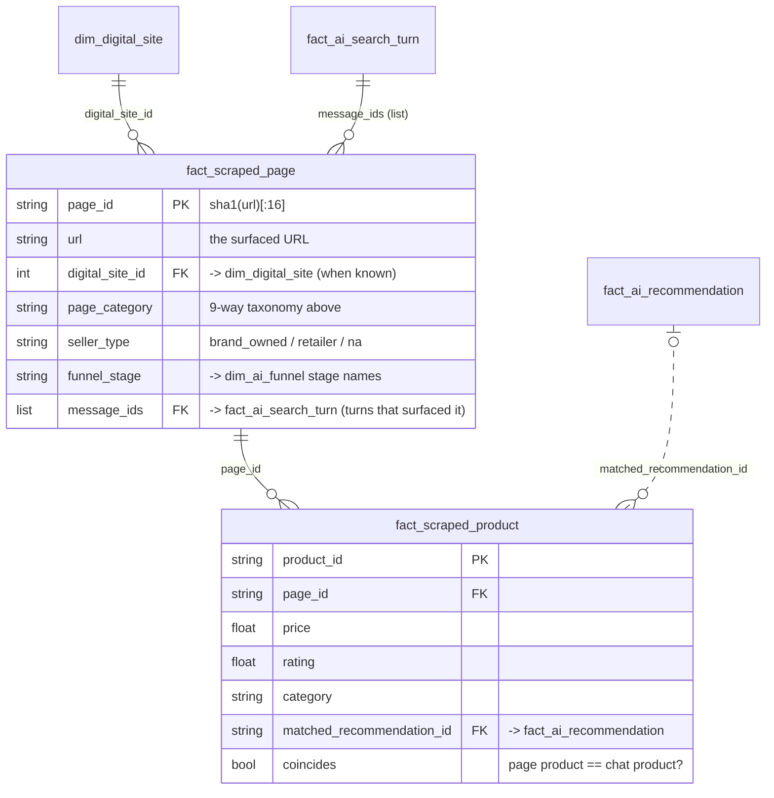

# Schema — scraped surfaced pages (`conveyer.scraping`)

The dataframe the user-facing question asked for: every URL surfaced during the
skincare conversations (the link columns of the SimilarWeb clickstream star
schema — see [`DATA_DICTIONARY.md`](DATA_DICTIONARY.md) §2), scraped, classified
into funnel-mapped page categories, with the products found on each page
extracted and matched back to the product the agent mentioned in the chat.

Produced as a **two-table parquet star**:

| File (default path) | Grain | Rows come from |
|---|---|---|
| `outputs/scrape/scraped_pages.parquet` (`fact_scraped_page`) | one **URL** | `dim_digital_site.url` ∪ `fact_ai_click_through.surfaced_url` ∪ `simweb_input_file.{a_links_source, next_10_urls, ai_click}` |
| `outputs/scrape/scraped_products.parquet` (`fact_scraped_product`) | one **product found on a page** | schema.org `Product` JSON-LD → OpenGraph `product:*` → microdata → visible-price heuristic |

Regenerate with `python -m conveyer.scraping` (offline synthetic corpus) or
`python -m conveyer.scraping --clickstream-dir data/similarweb_clickstream_data
--online` (real URLs, polite fetching). Demo + profiling:
[`notebooks/05_page_scraping.ipynb`](../notebooks/05_page_scraping.ipynb).

---

## 1 · Page taxonomy

The classifier answers three questions per page, kept as **orthogonal axes** so
the headline label stays simple:

1. **`page_category`** — what the page *is* (the discovery/shopping/unrelated
   split requested, plus four proposed additions the data makes unavoidable);
2. **`seller_type`** — for commerce pages, who owns the storefront
   (*external retailer* vs *brand owned* — the requested split, lifted out of
   the category);
3. **`funnel_stage`** — the `dim_ai_funnel` stage the page role maps to, so
   pages plug straight into the journey model (`conveyer.funnel`).

| `page_category` | Funnel stage | Definition | Origin |
|---|---|---|---|
| `brand_landing` | Discovery | Brand homepage or campaign/landing page — introduces the brand, nothing specific to buy | requested |
| `catalogue` | Discovery | Category / collection / listing page showing many products | requested |
| `shopping` | Intent (Purchase for cart/checkout subtypes) | Transactional page for a specific product: PDP, cart, checkout | requested |
| `editorial` | Evaluation | Reviews, "best X for Y" listicles, buying guides, blogs | **proposed** |
| `search` | Intent | Search-engine SERP or on-site search results | **proposed** |
| `community` | Evaluation | Forums / social / UGC: reddit, youtube, Q&A, review communities | **proposed** |
| `reference` | Awareness | Encyclopedic / medical / how-to pages (wikipedia, .gov/.edu) | **proposed** |
| `unrelated` | Irrelevant | Confidently off-topic for the skincare-shopping study | requested |
| `unknown` | Irrelevant | Fetch failed, or too little signal to decide | escape hatch |

Why the proposed four: the vendor's own `dim_digital_site.page_type`
distribution (search 46k · marketplace 6.7k · category 6.4k rows) plus the
editorial/community pages that dominate skincare discovery don't fit the three
requested buckets, and each occupies a distinct funnel position.

**Topical relevance is a separate judgement from page structure**: a PDP that
sells laptops is `page_category = unrelated` while `page_subtype` keeps the
structural reading (`pdp`), so no information is destroyed.

`page_subtype` (structural): `homepage · landing · brand_site · collection ·
category · marketplace · listing · pdp · cart · checkout · article · review ·
listicle · serp · site_search · forum · social · qa · wiki · health · howto ·
other`. The vendor's `page_type` maps onto these
(`taxonomy.SIMILARWEB_PAGE_TYPE_TO_SUBTYPE`) and acts as a classifier prior.

---

## 2 · ER diagram

---

## 3 · `fact_scraped_page` — 52 columns (grain = one URL)

### Identity & URL parts

| column | type | description |
|---|---|---|
| `page_id` | string | **PK.** `sha1(url)[:16]` — stable across re-runs |
| `url` | string | the surfaced URL (join key back to `dim_digital_site.url`) |
| `final_url` | string | after redirects (online mode) |
| `domain` | string | registrable domain (`amazon.co.uk`-aware) |
| `subdomain` / `path` / `query` | string | URL components |
| `digital_site_id` | int64 (nullable) | **FK → `dim_digital_site`** when the URL came from the clickstream |

### Fetch metadata

| column | type | description |
|---|---|---|
| `fetch_status` | string | `ok · cached · error · skipped · offline_miss · robots_blocked` |
| `http_status` | int32 (nullable) | HTTP code (null when never fetched) |
| `content_type` | string | response content-type |
| `fetched_at` | string | UTC ISO timestamp |
| `fetch_error` | string | error detail when `fetch_status != ok` |
| `from_cache` | bool | served from the on-disk fetch cache |
| `parser` | string | `stdlib` or `bs4` (auto-upgrades when installed) |

### Extracted page info ("all the info of the web page we can")

| column | type | description |
|---|---|---|
| `lang` | string | `<html lang>` / `og:locale` |
| `title` / `meta_description` / `h1` | string | head + first heading |
| `canonical_url` | string | `<link rel=canonical>` |
| `og_type` / `og_site_name` | string | OpenGraph |
| `word_count` / `n_links` / `n_images` | int32 | body statistics |
| `n_products` | int32 | products extracted (rows in the product table) |
| `has_price` / `has_add_to_cart` / `has_jsonld` | bool | commerce signals |
| `schema_types` | list\<string\> | all schema.org `@type`s (JSON-LD + microdata) |
| `text_excerpt` | string | first 2,000 chars of visible text |

### Classification

| column | type | description |
|---|---|---|
| `page_category` | string | headline label (taxonomy §1) |
| `page_subtype` | string | structural reading (survives the `unrelated` collapse) |
| `page_category_confidence` | float64 | softmax over category-level rule scores, 0–1 |
| `seller_type` | string | `brand_owned · retailer · na` |
| `funnel_stage` | string | Awareness … Post-Purchase / Irrelevant |
| `classifier_method` | string | `rule · rule+prior · llm` |
| `skincare_relevance` | float64 | 0–1 topical score (keywords + brand + domain) |
| `is_study_relevant` | bool | `skincare_relevance ≥ 0.15` |
| `primary_brand` | string | page-intrinsic brand (brand domain or `product:brand`) |
| `brand_detected` | list\<string\> | page brand ∪ brands the chat mentioned on linked turns |

### Provenance & vendor prior

| column | type | description |
|---|---|---|
| `source_tables` | list\<string\> | which link columns surfaced it (`click_through · a_links_source · next_10_urls · ai_click`) |
| `times_surfaced` / `times_recommended` / `times_visited` | int32 | event counts from `fact_ai_click_through` |
| `resulted_in_purchase_any` | bool | any surfacing event ended in a purchase flag |
| `n_message_ids` / `message_ids` | int32 / list\<string\> | the turns this URL attaches to |
| `prior_page_type` / `prior_seller_type` / `prior_retailer_brand` / `prior_site_category` | string | the `dim_digital_site` weak labels, kept verbatim for audit (`""` when absent) |

---

## 4 · `fact_scraped_product` — 26 columns (grain = one product on a page)

### Extracted metadata (price, description, rating, category)

| column | type | description |
|---|---|---|
| `product_id` | string | **PK.** `sha1(page_id·name·sku·idx)[:16]` |
| `page_id` / `url` | string | **FK → `fact_scraped_page`** (+ denormalized URL) |
| `name` / `brand` / `description` / `category` | string | as declared by the page |
| `price` / `price_min` / `price_max` | float64 (nullable) | offer price; min/max across offers |
| `currency` | string | ISO code from the offer |
| `availability` | string | schema.org availability tail (`InStock`, …) |
| `rating` | float64 (nullable) | aggregate rating value |
| `rating_count` | int32 (nullable) | review/rating count |
| `sku` / `gtin` | string | identifiers when declared |
| `image` | string | primary product image URL |
| `extraction_source` | string | `jsonld · opengraph · microdata · heuristic` (best-first) |

### Match to the chat recommendation ("does it coincide?")

| column | type | description |
|---|---|---|
| `matched_message_id` | string | the turn whose links surfaced this page |
| `matched_recommendation_id` | string | **FK → `fact_ai_recommendation`** best-matching entity |
| `matched_entity` | string | that entity's `entity_context` (LLM-written description) |
| `matched_brand` / `matched_category` | string | the entity's `BRAND` / `CATEGORY` concepts |
| `match_type` | string | strongest evidence: `sku · brand · name · category · none` |
| `match_score` | float64 | 0–1 blended score (SKU 1.0 > brand 0.75+ > name overlap > category 0.3) |
| `coincides` | bool | `match_score ≥ coincide_threshold` (default 0.5) |

---

## 5 · Join paths & caveats

| join | how |
|---|---|
| page → surfaced-link events | `fact_scraped_page.url = fact_ai_click_through.surfaced_url` or `digital_site_id` |
| page → conversation turn(s) | explode `message_ids` → `fact_ai_search_turn.message_id` |
| product → chat entity | `matched_recommendation_id → fact_ai_recommendation.recommendation_id` |
| page → vendor site catalog | `digital_site_id → dim_digital_site` |

1. **Turn-level linkage, by construction.** `fact_ai_click_through.recommendation_id`
   is 100% null in the source data, so a URL attaches to a *turn*, not an
   entity. `matched_recommendation_id` is therefore *inferred* by the
   brand/name/SKU matcher — carry `match_score` into any downstream analysis
   rather than treating the link as ground truth.
2. **Validated on synthetic ground truth** (category / seller / coincide all
   1.0 on the built-in corpus — `conveyer.scraping.pipeline.evaluate`). That
   certifies the plumbing and rules, **not** real-world accuracy; on real pages
   expect degradation from JS-rendered content (no headless browser), bot
   walls, and unmarked-up products.
3. **Offline by default.** Nothing touches the network unless
   `ScrapeConfig(offline=False)` / `--online`. Online mode obeys robots.txt,
   rate-limits per domain, retries with backoff, caps body size and caches
   every fetch under `outputs/scrape_cache/`.
4. **The vendor prior is a prior, not truth.** `prior_page_type` disagrees with
   the classifier on genuinely ambiguous pages; both are kept so the
   disagreement is auditable (`classifier_method` tells you when the prior was
   blended in).
5. **String `"None"` normalisation** from `dim_digital_site` is applied when
   building the candidate table (prior columns arrive clean or `""`).
