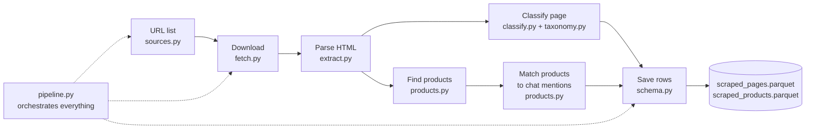

# The scraping module, explained (`conveyer/scraping`)

A plain-language walkthrough of module 2: what each step does, **which
technology it uses**, why it was built that way, where to look when
troubleshooting, what to improve, and what the alternatives are.
Companion docs: [`SCRAPED_PAGES_SCHEMA.md`](SCRAPED_PAGES_SCHEMA.md) (the
output tables, column by column) and [`DATA_DICTIONARY.md`](DATA_DICTIONARY.md)
(the input data).

---

## 0 · What this module does, in one paragraph

The conversations dataset gives us a list of **URLs** — links the AI agent
showed, links the user clicked, and the next pages they browsed. This module
**downloads each page, reads it, and answers three questions**: *What kind of
page is this?* (brand homepage, product page, cart, review article, …), *Who is
selling here?* (the brand itself, or a retailer like Amazon/Sephora), and *Does
the product on this page match what the agent recommended in the chat?* The
answers become two parquet tables (`scraped_pages`, `scraped_products`) that
module 3 (`journey.py`) uses to measure conversion.



One config object (`ScrapeConfig` in `config.py`) controls all of it —
timeouts, thresholds, file paths, which classifier to use. Change behaviour
there, not inside the step files.

---

## 1 · The pipeline, step by step

### Step 1 — Build the URL list (`sources.py`)

**What it does.** Reads the input parquet(s) and produces one row per distinct
URL, with *provenance*: how many times it was surfaced, whether the agent
recommended it, whether the user visited it, which chat turns (`message_id`s)
it belongs to, and dwell time (how long the user stayed, computed from the
`request_time` gaps between consecutive trail entries). It also builds the
**mentions map**: for each chat turn, which brands/categories/products the
agent talked about (from `fact_ai_recommendation` + `fact_ai_concept`).

**What it uses.** Just **pandas** — reading parquet files, looping rows,
grouping by URL. No scraping happens here.

**In plain terms.** Before going shopping, write the shopping list. This step
turns messy event logs into a clean to-do list of URLs, and keeps a cheat
sheet of "what the agent said" next to each one so step 6 can compare.

**Troubleshooting.** If URL counts look wrong, this is the file. It accepts
either a directory of SimilarWeb star-schema parquets *or* a single
`conversations.parquet` — table names are matched by filename hints
(`_TABLE_HINTS`). `--only-recommended`, `--dedupe-by domain`, `--max-urls`
filter the list here.

### Step 2 — Download each page (`fetch.py`)

**What it does.** Fetches the HTML of each URL, politely and safely:

| Behaviour | Setting | Default |
|---|---|---|
| Obey `robots.txt` (the file where sites say what bots may visit) | `respect_robots` | on |
| Present a realistic browser header profile | `browser_headers` | on |
| Max 1 request per second per domain | `rate_limit_per_domain` | 1.0 s |
| Retry transient failures, doubling the wait | `max_retries`, `retry_backoff` | 2 retries, 2 s |
| Give up on any URL after a wall-clock cap | `hard_timeout` | 30 s |
| Stop reading bodies past a size cap | `max_bytes` | 2 MB |
| Only accept HTML | `allowed_content_types` | text/html |
| Save every fetch to disk, never re-hit a site | `cache_dir`, `use_cache` | on |

**Bot walls: don't hammer, salvage everything.** Many CDNs 403 unknown
user-agent strings before the origin ever sees the request, so by default the
fetcher presents a normal desktop-browser header profile
(`browser_headers=True`; set it off to send the descriptive
`user_agent` bot string instead). This changes *presentation only* —
robots.txt, the per-domain rate limit, the circuit breaker and the wall-clock
cap all still apply. When a wall does fire:

* **401/403/406/451 are never retried** — a wall answers the same way every
  time; the result is `fetch_status="blocked"` and the domain's circuit
  breaker counts it, so a fully walled domain stops being contacted;
* **429 honors `Retry-After`** once, when it fits the wall-clock budget;
* **everything the response DID give us is kept**: the response headers
  (`response_headers` column, also captured on OK fetches) and a bounded
  error-body excerpt. The headers alone often fingerprint the platform
  (`server_platform` column — `x-shopify-stage` ⇒ Shopify), which feeds the
  classifier's platform channel: a bot-walled Shopify store's `/products/…`
  URL still classifies `shopping · pdp · brand_owned`. The error body is
  used **only** for fingerprinting — it never masquerades as page content.

**What it uses.** The **`requests`** library (the standard Python HTTP
client) for downloads; **`concurrent.futures.ThreadPoolExecutor`** (standard
library) to run 12 downloads in parallel — submitted through a **sliding
window** (~2× workers in flight, completed futures dropped immediately) so
fetched HTML never accumulates in RAM; **`urllib.robotparser`** (standard
library) to *parse* robots.txt — but the file itself is fetched with a bounded
timeout, because the stdlib reader can hang forever on a dead host. The cache
is one JSON file per URL, named by a SHA-256 hash of the URL.

**In plain terms.** Twelve polite couriers knock on doors in parallel. Each
courier checks the "no soliciting" sign (robots.txt), waits their turn at
each house (rate limit), gives up after 30 seconds no matter what
(hard timeout), and photocopies everything they receive (cache) so nobody
ever has to knock twice.

**Two modes.** `offline=True` (default) serves pages from an in-memory corpus
(the synthetic generator, or the disk cache) — nothing touches the network.
`--online` does real fetching. This is why the whole pipeline runs in CI and
notebooks with no connectivity.

**Troubleshooting.** Every outcome is recorded on the page row:
`fetch_status` (`ok` / `cached` / `error` / `skipped` / `offline_miss` /
`robots_blocked` / `blocked` / `circuit_open`), `http_status`,
`fetch_error`, plus the salvage columns `response_headers` and
`server_platform`. Start any debugging session with
`pages.fetch_status.value_counts()`.

### Step 3 — Parse the HTML (`extract.py`)

**What it does.** Turns the raw HTML string into a structured `PageContent`
object: title, meta description, OpenGraph tags, headings (h1/h2/h3), visible
text, all links and images, language, canonical URL — and, crucially, the
**machine-readable product data** many shops embed: `application/ld+json`
blocks (JSON-LD) and microdata attributes.

**What it uses.** Two interchangeable parsers. Default: a subclass of the
standard library's **`html.parser.HTMLParser`** (zero dependencies). If
**BeautifulSoup + lxml** are installed, it upgrades to them automatically
(`html_parser="auto"`); they are more tolerant of broken HTML and faster.
JSON-LD blocks are decoded with the standard **`json`** module.

**In plain terms.** A page is a letter written in HTML. This step opens the
envelope and sorts the contents into labelled trays: "headline", "summary",
"body text", "links", and — the gold tray — "structured product data",
which is the same machine-readable format (schema.org) that shops write
specifically so Google Shopping can read their prices.

**Troubleshooting.** The `parser` column says which backend parsed each page.
If a page fetched OK but `word_count ≈ 0` and no JSON-LD, the site probably
renders with JavaScript — the HTML we downloaded is an empty shell (see
§5, improvement 1).

### Step 4 — Extract products (`products.py`, `extract_products`)

**What it does.** Pulls a list of `ProductRecord`s (name, brand, price,
currency, rating, review count, SKU, availability, image, category) out of the
parsed page. It tries sources **from most to least reliable**:

1. **JSON-LD `schema.org/Product`** objects (and `ItemList`s of them) — the
   structured data shops publish for search engines; richest and most exact.
2. **Microdata** (`itemscope`/`itemprop` attributes) — an older way of
   embedding the same schema.org data inline.
3. **OpenGraph `product:*` meta tags** — the tags used for link previews;
   name/price/brand only.
4. **Heuristic** — last resort: if the visible text contains a price pattern
   (`$12.99`, `€9`, regex `_PRICE_RE`), take the H1/title as the product name.

Duplicates are collapsed on (name, price), keeping the record with the most
filled fields. Capped at `max_products_per_page = 40`.

**What it uses.** Pure Python + **regular expressions**. No ML, no network.
The order *is* the design: degrade gracefully instead of returning nothing.

**In plain terms.** First read the shop's official price tag (JSON-LD); if
missing, the handwritten tag (microdata); then the shop-window sticker
(OpenGraph); and if all else fails, squint at the page text for anything that
looks like "$19.99". The `extraction_source` column tells you which one won.

### Step 5 — Classify the page (`classify.py` + `taxonomy.py`)

This is the heart of the module, and the most likely place you'll tune.

**What it does.** Assigns each page:

* `page_category` — one of **brand_landing / catalogue / shopping /
  editorial / search / community / reference / unrelated / unknown**;
* `page_subtype` — the finer structural role (pdp, cart, checkout, serp,
  collection, article, forum, …);
* `seller_type` — `brand_owned` vs `retailer` (only for commerce pages);
* `funnel_stage` — Discovery / Evaluation / Intent / Purchase / …, mapped from
  the category+subtype in `taxonomy.py`;
* `skincare_relevance` (0–1) and `is_study_relevant` — is this page on-topic?
  The topical umbrella is **beauty / personal care** (skincare + haircare +
  bodycare + cosmetics — a thickening conditioner counts as much as a retinol
  serum; the column name predates the wider vocabulary). Every keyword must be
  unambiguous at a single hit, so polysemes like *foundation*, *powder* or
  bare *conditioner* after "air" stay out; add your own terms per run with
  `ScrapeConfig(extra_relevance_terms=("beard oil",))`;
* `confidence`, and `classification_signals` — *which evidence fired*.

**How it decides: independent "voters".** Each modality scores subtypes
with hand-set weights; votes are summed; the highest-scoring subtype wins.

| Voter | Evidence | Example | Tech |
|---|---|---|---|
| **URL structure** | tokens in path/query | `/cart` → cart (2.5), `/dp/` → pdp (2.0), `?q=` → serp (2.0) | regex |
| **Service routing** | subdomain + first path segment on multi-service platforms | `docs.google.com` → tool, `maps.google.*` → local, `shopping.google.*` → marketplace, `facebook.com/marketplace` → marketplace (deep item pages demote to `listing`, so fetched off-topic listings still collapse) | `_PLATFORM_SERVICES` table; **replaces** the generic domain vote; an unrecognized Google surface gets *no* domain opinion instead of a false "search"; two-letter locale subdomains (`cn.bing.com`) stay transparent |
| **Domain knowledge** | registrable domain vs curated lists | `amazon.*` → retailer, `reddit.*` → community, `cerave.com` → brand site | Python sets in `classify.py` + the shared brand lexicon `conveyer/brands.py` |
| **Page markup** | schema.org types, og:type, price/add-to-cart, product count | `@type: Product` → pdp; ≥3 products → collection | reads `PageContent` |
| **Vendor prior** | SimilarWeb's own `page_type` label | `page_type=checkout` → +1.5 to checkout | weight `3.0 × prior_weight (0.5)` |
| **Domain directory** | the directory entry's role, for domains the curated lists don't know | external-file entry `role: retailer` → same votes a curated retailer gets | `directory.py`; only speaks when the platform table and domain lists are silent |
| **Platform fingerprint** | response headers / markup identify the commerce platform | `x-shopify-stage` header → storefront corroboration + `seller_type=brand_owned` hint — works **even on a 403**, and the domain profile remembers it after the circuit opens | `fingerprint.py`; deliberately below the decisive bar; **structural evidence only** — it keeps an unfetchable `/products/…` in `shopping`, but never makes an off-topic store study-relevant, and it is suppressed on curated retailer domains (credobeauty runs Shopify but stays a retailer) |
| **Learned model** | self-trained multinomial logistic over hashed URL/markup/text features | `model_weight (2.0) × probability` for the top subtypes | `model.py`; autotrains on synthetic ground truth, self-trains on your parquet: `python -m conveyer.scraping.model train --pages …` |

Confidence is a **softmax** over the summed category scores — roughly "how
much did the winner beat the runners-up".

The service table also adds three subtypes to the taxonomy: `local` (maps /
places → reference), `tool` (docs/drive/mail/cloud consoles → unrelated) and
`account` (sign-in walls → unrelated) — these were the URLs that previously
all collapsed into "search" just because the domain was `google.com`.

**The learned model** predicts the structural subtype only (topical relevance
stays its own axis), persists as a plain `.npz` (numpy-only inference), and
votes below the decisive rule weights — it tips ties, it cannot overrule a
`/cart/` path. Standalone it cross-validates at ~0.73 on the seed training
frame (495 samples); its value grows with self-training:
`python -m conveyer.scraping.model train --pages outputs/scrape/scraped_pages.parquet`
absorbs your real corpus's confident rows as weak labels, and
`python -m conveyer.scraping.model eval` prints the per-subtype
precision/recall table. Disable with `use_learned_model=False`.

**One veto rule: decisive transactional URL tokens win outright.** A page
under `/cart/`, `/checkouts/`, `/gp/cart`, `/order-history` *is* that page no
matter how product-like its body looks — cart pages necessarily show prices
and checkout buttons, so those markup signals are furniture, not counter-
evidence. (This is the lesson of a real bug: Amazon's
`/cart/add-to-cart/…` page scored pdp 3.5 from its own furniture vs cart 2.5
from the URL and collapsed to `unrelated`.) When the override fires it is
recorded as `url_override` in `classification_signals`, and the heuristic
product extractor is disabled on such URLs so cart furniture can't mint a
phantom product. Weak *query* hints (`?ref_=nav_cart`) stay advisory — a real
PDP reached from the cart button is still a PDP.

**The second axis: relevance.** Independently of *structure*, a keyword regex
(`serum`, `retinol`, `SPF`, `moisturizer`, …) plus brand-mention checks score
how *skincare-related* the page is. The two axes then combine with care:

* An Amazon **cart** URL contains no skincare words *by nature* — carts,
  checkouts, search pages and storefront homepages are **topic-neutral
  journey infrastructure** and are never punished for it (but that status must
  be *earned* by structural evidence — `sephora.com/careers` doesn't qualify).
* A fetched **article** with zero skincare signal collapses to `unrelated`
  (a confident judgement — it needs content to stand on).
* An **unfetchable** `amazon.com/dp/…` keeps its earned "shopping" label
  (the URL alone proves it); an unfetchable nothing-page falls to `unknown`.

**The fallback chain (why blocked pages still classify).** Orchestrated in
`pipeline.py::_process_one`, recorded in `fetch_scope`:

1. `page` — the page itself was fetched: all voters play.
2. `stripped` — the exact link failed → retry it **without its query
   string**: a stale `…/how-to-choose-the-best-sunscreen/?preview_id=10472&preview_nonce=…`
   errors while the bare article loads. "Failed" includes **soft errors**:
   an HTTP-successful response that is really an error page — a WordPress
   preview-nonce failure (200 + "not allowed to preview" or a `wp-login`
   redirect) or an anti-bot **challenge shell** (202 + a couple hundred
   bytes of script). A soft-error body is *never* classified as the page's
   content: if the stripped variant is healthy it takes over; otherwise the
   shell is dropped and the chain continues below (a "Page not found" title
   must not label a page `unrelated`). Near-empty bodies are also never
   cached, so recoveries self-heal. The stripped variant is the *same
   document*, so its content counts as the page's own — it can prove
   relevance or `unrelated`, and products ARE extracted. Guard: never fires
   when the query *selects* the content (`?q=`, `?variant=`, `?asin=`,
   `?page=`, `?v=` …). Audited as `query_stripped` in
   `classification_signals`; knob: `query_strip_fallback` (default on).
3. `base` — still failing → fetch the site's homepage
   (`scheme://host/`) so domain-level content still informs the label.
   Products are **not** extracted from the stand-in homepage.
4. `directory` — nothing fetchable at all (**`robots_blocked`**, bot wall on
   the homepage too, dead host) → the **domain directory**
   (`directory.py`) supplies a stored *description of the site* that stands
   in as content: "Sephora — specialty beauty retailer selling skincare,
   makeup…". The directory ships a built-in seed (every curated domain, with
   hand-written entries for the top sites) and merges an optional external
   JSON file (`ScrapeConfig.directory_path`, default
   `data/domain_directory.json`) where you can add long-tail domains without
   touching code. Stand-in descriptions supply *relevance*, but can never
   prove a page `unrelated`, never yield products, and never mint a category
   the URL didn't structurally earn (`sephora.com/careers` stays `unknown`).
5. `none` — no directory entry either: URL tokens + domain lists + vendor
   prior alone. An unreachable cart on an unheard-of domain is still,
   correctly, a cart.

**Optional LLM refinement.** With `classifier="llm"`, or `"auto"` when rule
confidence < 0.55, and the **`anthropic`** package + `ANTHROPIC_API_KEY`
present, the page's URL/title/meta/H1/schema-types/first-800-chars go to a
Claude model (`llm_model` in config, override with `ANTHROPIC_MODEL`), which
returns a JSON verdict. Any API error silently falls back to the rule result.
The `classifier_method` column records `rule`, `rule+prior`, or `llm`.

**In plain terms.** Four witnesses look at each page — one reads only the
address, one only recognises the neighbourhood, one only looks through the
window, one only repeats what SimilarWeb said. They vote; the majority wins;
we write down who voted (`classification_signals`) so every label can be
audited. A separate question — "is this about skincare at all?" — can
overrule the winner to `unrelated`, except for pages (carts, checkouts,
search boxes) whose job never mentions skincare in the first place. If a
verdict is shaky, optionally ask an expensive expert (the LLM).

### Step 6 — Match products to the chat (`products.py`, `match_products`)

**What it does.** For each product found on a page, compares it against every
product the agent mentioned on the turn(s) that surfaced this URL, and keeps
the best match — **precision-first, in tiers** (`match_strength`):

| Tier | Reached by | May coincide? |
|---|---|---|
| **exact** | SKU identity; or brand agreement + near-identical name | ✔ |
| **strong** | brand agreement + **name** corroboration (core-token containment ≥ 0.34 or char-trigram ≥ 0.45); or, with no brand info, a near-identical multi-token name (containment ≥ 0.85 / trigram ≥ 0.7) | ✔ |
| **likely** | brand alone; brand + only a shared form/category word (an Eye Repair Cream is not the Moisturizing Cream); moderate name similarity alone | ✘ |
| **none** | nothing meaningful | ✘ |

Name evidence is measured on the name's **core tokens** (brand words
excluded from the ratio, sizes stripped) and requires at least two of them —
a bare "Moisturizer" identifies nothing. Attribute/category agreement raises
the score but never substitutes for the name.

`coincides` requires **exact or strong** *and* `match_score ≥
coincide_threshold` — the same brand is *not* the same product (the old
scorer's 0.75-for-brand-alone made a CeraVe cleanser "coincide" with a CeraVe
moisturizer mention). Two **veto rules** cap any match at `likely` no matter
how similar the names read:

* **brand conflict** — the page product's brand disagrees with the mention's
  ("Cetaphil Moisturizing Cream" vs a CeraVe mention);
* **attribute conflict** — identity-bearing attributes disagree: SPF numbers
  (SPF 30 ≠ SPF 60) and product-form words (a *lotion* is not the *cream*).
  Sizes and counts ("19 oz", "2-pack") are stripped first — packaging, not
  identity.

Brand agreement itself has three routes, so long-tail brands connect too:
the shared lexicon (`conveyer/brands.py`), fuzzy string identity
(char-trigram ≥ 0.72), or the product brand's **distinctive token appearing
in the mention's entity text** — that last one links a `JBCA` conditioner PDP
to a turn that recommended "the JBCA thickening conditioner" even though no
lexicon knows the brand. Character trigrams also make names typo-robust
("CereVe Moisturising Cream" still matches). Every verdict records *which*
evidence fired in `match_signals`.

The page row carries the roll-up: `chat_match_strength` / `chat_match_score`
= the best tier among the page's products vs the mentions of the turns that
surfaced it — the page ↔ chat connection at the page grain, ready for the
funnel model.

**What it uses.** Pure Python set operations, char-trigram cosine, + the
shared `normalize()` helper from `conveyer/ingest.py`. No fuzzy-matching
library needed; the trigram channel covers what short-string embeddings
would.

**In plain terms.** The agent said "try the CeraVe Moisturizing Cream". The
user lands on a page selling "CeraVe Moisturizing Cream 19 oz". Same barcode?
Match. Same brand *and* the name agrees? Match. Same brand but it's the lip
balm? Noted as `likely`, **not** counted — and if the page says SPF 30 where
the chat said SPF 60, that mismatch alone disqualifies it.

### Step 7 — Save everything, crash-proof (`schema.py` + `pipeline.py`)

**What it does.** Writes two tables with **pinned pyarrow schemas** (types
declared explicitly, so nullable ints and list columns survive the parquet
round-trip):

* `scraped_pages.parquet` — one row per URL (~55 columns: URL parts, fetch
  metadata, extracted info, classification, provenance, dwell).
* `scraped_products.parquet` — one row per product, FK `page_id`.

The write strategy makes long runs safe **and keeps memory flat** no matter
how many pages the run covers:

* the moment a page finishes, its rows are **appended to `.jsonl` sidecars**
  (products first, then the page line as the *commit marker* — so a crash
  between the two writes can't leave orphan products);
* every `checkpoint_every = 500` pages, the in-memory buffer is **flushed to
  a parquet part file** (`scraped_pages_parts/part-000042.parquet`) and
  **cleared** — RAM holds at most one checkpoint's worth of rows. Mid-run
  progress is directly queryable:
  `pd.read_parquet("outputs/scrape/scraped_pages_parts")`;
* on exit **including Ctrl-C**, the parts are **streamed** one at a time into
  the final single-file parquet — the full table is never materialized in
  memory;
* with `resume=True` (default), a re-run reads only the *done-URL set* from
  the sidecar (not the rows) and **skips URLs already done**; rows that a
  hard crash left in the JSONL but not yet in a part are recovered into parts
  in bounded chunks. Outputs from before the parts format migrate
  automatically;
* the **raw HTML of every fetched page is on disk**, one file per URL, in
  `outputs/scrape_cache/` — the page row's **`html_path`** column points at
  it, so any page can be re-inspected or re-classified without re-fetching.
  Offline replays read these files lazily, never preloading them into RAM.

**What it uses.** **pyarrow** for parquet (`ParquetWriter` for the streaming
concat), plain file-append for JSONL, standard **`json`** for the lines.
Results stream in "as completed" from the thread pool, so there is no batch
barrier — one slow site never blocks the rest.

**In plain terms.** A ship's logbook (JSONL) written line by line as events
happen; every 500 entries the pages on the desk are filed into a numbered
folder (part file) and the desk is swept clean; at the end the folders are
bound into one book (final parquet), one folder at a time. If the ship sinks
mid-sentence you lose at most that one line, and the next voyage starts where
the log ends — the desk never gets fuller than 500 pages.

### Step 8 — Self-evaluation (`pipeline.py::evaluate` + `synthetic.py`)

**What it does.** When running on the **synthetic corpus** — generated pages
(brand sites, PDPs, editorials, off-topic pages) that carry ground-truth
labels — the run scores itself: `category_accuracy`, `seller_accuracy`, and
`coincide` accuracy/precision/recall.

**What it uses.** pandas joins on the ground-truth frame; numpy for the
synthetic generator.

**In plain terms.** A practice exam with an answer key. It proves the
machinery works end-to-end, but — important honesty note — **real pages are
messier than synthetic ones**, so treat these numbers as an upper bound, not
a promise (see §5, improvement 3).

---

## 2 · Technology inventory (one table)

| Step | File | Technology | Type | Fallback if missing |
|---|---|---|---|---|
| URL list | `sources.py` | pandas | required | — |
| Download | `fetch.py` | requests, ThreadPoolExecutor, urllib.robotparser | required (online only) | offline mode needs nothing |
| Parse HTML | `extract.py` | html.parser (stdlib) / BeautifulSoup + lxml | stdlib / optional | stdlib parser |
| Products | `products.py` | regex + json (stdlib) | stdlib | — |
| Classify | `classify.py`, `taxonomy.py` | regex, curated domain sets, softmax (math stdlib) | stdlib | — |
| LLM refine | `classify.py` | anthropic SDK + API key | optional | rule result |
| Match | `products.py` | set ops, Jaccard overlap | stdlib | — |
| Save | `schema.py` | pyarrow, JSONL | required | — |
| Synthetic + eval | `synthetic.py`, `pipeline.py` | numpy, pandas | required | — |

Only pandas/numpy/pyarrow/requests are hard requirements. Everything else
degrades gracefully — that's the project's "graceful upgrades" principle.

---

## 3 · Troubleshooting: read the audit trail, not the code

Every design decision leaves a column behind. When a label looks wrong, these
six columns almost always explain it:

| Column | Question it answers |
|---|---|
| `fetch_status` / `fetch_error` / `http_status` | Did we even get the page? (`error` + HTTP 403 = bot wall) |
| `fetch_scope` | Did the label come from the page (`page`), the homepage stand-in (`base`), the domain directory's description (`directory`), or the URL alone (`none`)? |
| `classification_signals` | Which voters fired: `url` / `domain` / `markup` / `prior` / `content` / `base_content` / `directory` / `directory_content` / `llm`; audit markers: `url_override` (transactional URL beat the markup vote), `url_validated` (repaired by the validate tool), `reclassified` (rescued by the content-aware `--reclassify` pass) |
| `classifier_method` | `rule`, `rule+prior`, or `llm` |
| `page_category_confidence` | How decisive the vote was (softmax) |
| `extraction_source` (products) | jsonld / opengraph / microdata / heuristic |

Typical symptoms:

* **Lots of `unknown`** → URLs with no fetch, no known domain, no telling
  tokens. Check `fetch_status` first; consider the LLM pass for the residue.
* **Fetched OK but empty (`word_count` ≈ 0, no products)** → JavaScript-only
  site; the classifier fell back to URL/domain evidence. See improvement 1.
* **`robots_blocked` on a domain you need** → the site forbids bots, so the
  page is never fetched — but classification still lands via the domain
  directory (`fetch_scope="directory"`). If the domain is missing from the
  directory, add it to `data/domain_directory.json` rather than flipping
  `respect_robots`.
* **Everything `offline_miss`** → you're in offline mode without a corpus or
  cache; add `--online` or point at cached data.
* **Machine slows down / dies mid-run (memory)** → shouldn't happen anymore.
  Two past causes, both fixed and regression-tested: fetch results (each
  holding up to 2MB of HTML) were retained for the whole run by the futures
  list — now a sliding window keeps at most ~2× workers of them alive; and
  row buffers/parquet rewrites grew with the run — now checkpoints flush to
  `*_parts/` and clear. If RAM is still tight, lower `--checkpoint-every`.
  To read the raw HTML of any page, follow its `html_path` column into
  `outputs/scrape_cache/`.
* **A page classified from its homepage** (`fetch_scope="base"`) → correct
  behaviour for blocked deep links; products deliberately absent.
* **Weird `coincides`** → inspect `match_type` / `match_score` on the product
  row and the mention's `matched_entity`; tune `coincide_threshold` /
  `match_name_threshold` in config.

**The URL-rule double check (`validate.py`).** Because the URL channel is the
most trustworthy voter for structural roles, every stored label can be
re-audited against it — no re-scrape needed:

```bash
python -m conveyer.scraping.validate outputs/scrape/scraped_pages.parquet          # report
python -m conveyer.scraping.validate outputs/scrape/scraped_pages.parquet --apply  # repair in place
```

It flags (and with `--apply`, repairs) two mismatch kinds: a stored
`unrelated`/`unknown` row whose URL alone proves a journey page, and a
`shopping` row whose URL carries a decisive cart/checkout token but whose
stored subtype disagrees (Intent vs Purchase — this moves the conversion
proxy). Repairs are audited: `classifier_method` gains `+url_validated` and
the signal list gains `url_validated`. `run_scrape` also prints a
`[validate]` summary at the end of every run, so this class of regression
can't ship silently.

**The content-aware rescue (`--reclassify`).** Labels are burned into the
parquet at scrape time and `resume=True` never revisits a finished URL — so
when the *relevance vocabulary* improves (e.g. widening skincare-only to all
of beauty/personal care, which had left a haircare conditioner PDP marked
`unrelated` with relevance 0.0), the fix must be applied retroactively:

```bash
python -m conveyer.scraping.validate outputs/scrape/scraped_pages.parquet --reclassify           # report
python -m conveyer.scraping.validate outputs/scrape/scraped_pages.parquet --reclassify --apply   # rescue in place
```

It re-runs the full classifier over every stored `unrelated`/`unknown` row
using the raw HTML the row's `html_path` points at in the fetch cache
(`--cache-dir` if it moved; Windows-style stored paths resolve fine on any
OS), falling back to the stored title/excerpt columns — **nothing is
re-fetched**. Repairs are rescue-only: a row changes only when the fresh
verdict is study-relevant with a real category; genuinely off-topic rows are
never touched. Rescued rows gain `+reclassified` / `reclassified` audit
marks, same contract as the URL check.

Also useful: the JSONL sidecars in `outputs/scrape/` are human-readable —
`tail -f scraped_pages.jsonl` during a run shows live progress; the cache in
`outputs/scrape_cache/` holds the raw HTML of every fetched page for replay.

---

## 4 · Concepts worth researching (your homework list)

Ranked: the first five give you 80% of the mental model.

1. **schema.org, JSON-LD, microdata, OpenGraph** — the machine-readable
   product data shops embed for Google; the #1 source of our product records.
   Search: *"JSON-LD Product schema"*, view-source any Sephora product page.
2. **robots.txt & crawl politeness** — what sites allow bots to do, and the
   etiquette (rate limits, user agents) this module implements.
3. **HTTP basics** — status codes (200/301/403/404/429), redirects,
   Content-Type; explains most `fetch_error` values.
4. **HTML parsing & the DOM** — what BeautifulSoup actually does; enough to
   read `extract.py`.
5. **Jaccard similarity & token overlap** — the matching math in one formula.
6. **Registrable domain / Public Suffix List** — why `amazon.co.uk` needs
   special handling (`_MULTI_TLD` is a hand-rolled mini-version of this).
7. **Softmax** — how vote scores become a 0–1 confidence.
8. **JSONL + parquet** — the two storage formats and why each is used where.
9. **Weak supervision / priors** — using SimilarWeb's noisy `page_type` label
   as a nudge rather than the truth.
10. **Headless browsers & anti-bot** (for the improvement work) — why
    JavaScript sites return empty HTML and what Playwright does about it;
    what Cloudflare/PerimeterX walls are.

---

## 5 · Known weaknesses → concrete improvements (ranked)

1. **JavaScript-rendered pages come back empty.** `requests` gets only the
   initial HTML; React/Vue storefronts ship an empty shell. Today those pages
   quietly fall back to URL/domain evidence.
   *Improvement:* detect the symptom (`fetch_status=ok` but `word_count<50`
   and no JSON-LD) and re-fetch just those through **Playwright** (headless
   Chromium) or a rendering API. Keep it a fallback tier — rendering is
   10–100× slower than plain HTTP.
2. **Big retailers block bots.** Amazon/Sephora/Ulta often answer 403 or a
   CAPTCHA page. The base-URL + domain-directory fallbacks absorb the
   *classification* damage (blocked pages still get category, seller and
   relevance), but product extraction is lost exactly where purchases happen.
   *Improvement:* accept it for the study (URL evidence suffices for funnel
   stage), or use official affiliate/product APIs for the top few domains, or
   a commercial scraping API (see §6) for that shortlist only.
3. **Evaluation only exists on synthetic data.** The generator's pages are
   clean; real accuracy is unknown.
   *Improvement:* hand-label 200–500 *real* pages (stratified by domain and
   category), store them as a labelled parquet, and extend
   `pipeline.evaluate` to score against them. This single artefact makes
   every other improvement measurable.
4. **Hand-tuned vote weights.** The 2.5-vs-1.6 style weights in
   `classify.py` are sensible but arbitrary, and `min_confidence` is unused
   in anger.
   *Improvement:* the per-modality votes are already logged — once you have
   labelled real pages (item 3), fit a **logistic regression (scikit-learn,
   already a dependency)** over the vote vector. You keep full auditability
   and gain calibrated confidence.
5. **Curated domain lists are static and US/skincare-centric.** New
   retailers, non-US domains, and new communities silently miss.
   *Improvement:* the external directory file (`data/domain_directory.json`)
   now covers the long tail without code changes — feed it from run logs
   ("high-traffic domain with no entry"). Also swap `_MULTI_TLD` for
   **`tldextract`** (uses the real Public Suffix List).
6. **Token-overlap matching is brittle.** "Vitamin C serum" vs "Ascorbic
   Acid 15%": zero overlap, same product.
   *Improvement (cheap):* **rapidfuzz** string similarity as an extra
   channel. *Improvement (better):* sentence embeddings — `conveyer/models.py`
   already auto-resolves an embedding backend; cosine-match
   `product.name + brand` vs `entity_context`.
7. **LLM refinement is per-page and synchronous.** Fine for hundreds, costly
   for 265k.
   *Improvement:* batch the low-confidence residue through the **Anthropic
   Batch API** (half price, async), cache verdicts by `(domain, subtype)`,
   and use a small fast model — page-type classification doesn't need a
   frontier model.
8. **URL noise inflates the workload.** Tracking parameters
   (`utm_*`, `ref_=`, `fbclid`) make one page look like many URLs.
   *Improvement:* canonicalize URLs (strip known tracking params, sort query
   keys) in `sources.py` before deduping — fewer fetches, cleaner joins.

---

## 6 · Alternatives, layer by layer

The module deliberately builds each layer from primitives. Here is the map of
what you could swap in, and when it's worth it.

### Fetching

| Option | What it is | Worth switching when… |
|---|---|---|
| `requests` + threads (**current**) | simple, synchronous HTTP, 12 workers | fine up to ~10⁵ URLs; you are here |
| `httpx` / `aiohttp` (async) | same job, one event loop instead of threads | you want 50–200 concurrent fetches cheaply |
| **Scrapy** | a full crawling *framework*: scheduler, auto-throttle, middlewares, retry policies | scraping becomes a permanent, growing operation |
| **Playwright / Selenium** | drives a real browser, executes JavaScript | the JS-empty-page problem (improvement 1) |
| Hosted scraping APIs (Zyte, ScrapingBee, Firecrawl, Bright Data, Apify) | they fetch for you: proxies, rendering, anti-bot handled, per-request pricing | a shortlist of high-value blocked domains justifies paying |
| **Common Crawl** | free monthly crawl of the web, downloadable | you'd accept stale snapshots to avoid fetching at all |

### Parsing / extraction

| Option | What it is | Worth switching when… |
|---|---|---|
| stdlib parser → bs4+lxml (**current**, auto) | generic HTML → structured fields | works; keep |
| **extruct** | dedicated structured-data extractor (JSON-LD, microdata, RDFa, OpenGraph) | you want to replace the hand-rolled JSON-LD/microdata code with the community standard |
| **selectolax** | very fast C-based HTML parser | parsing ever becomes the bottleneck (unlikely; network dominates) |
| **trafilatura** | main-article text extraction (strips nav/boilerplate) | cleaner text would help relevance scoring and the LLM prompt |

### Classification

| Option | What it is | Trade-off vs current rules |
|---|---|---|
| Multimodal rules (**current**) | four voters, hand weights | transparent, free, instant; plateaus in accuracy |
| Rules + **learned weights** (logistic regression) | same features, fitted weights | small step, big win once labels exist (improvement 4) |
| **Embeddings + centroid/kNN** | embed URL+title+text, compare to category descriptions | handles unseen phrasing; needs an embedding backend (already in `models.py`) |
| **LLM zero-shot** (current optional path) | ask a model per page | best accuracy on weird pages; cost/latency — use only on the low-confidence residue |
| **Fine-tuned small transformer** (e.g. DistilBERT) | train on a few thousand labels | fast + accurate at scale; most engineering effort |

The pragmatic architecture — and the one this module already sketches — is a
**cascade**: cheap rules label the easy 80–90%, and only the low-confidence
remainder escalates to embeddings or an LLM.

#### Blueprint: a fine-tuned DistilBERT page classifier

DistilBERT is a small transformer (66M parameters, ~40% smaller and ~60%
faster than BERT) that you *fine-tune*: take the pretrained model, add a
9-way classification head, and train it on labelled pages. Concretely:

1. **Get labels.** Three sources, cheapest first: (a) *silver* labels — pages
   where the rules are highly confident **and** the SimilarWeb prior agrees
   (free, thousands available); (b) *LLM labels* — run Claude once over
   5–20k diverse pages via the Batch API and keep its verdicts (distillation:
   the big model teaches the small one); (c) a *gold* hand-labelled set of
   300–500 pages, reserved purely for evaluation, never training.
2. **Build the input text.** One string per page from the same evidence the
   rules read, e.g.
   `url: sephora com shop moisturizer [SEP] title: Moisturizers | Sephora
   [SEP] schema: itemlist [SEP] text: <first ~150 words>` — truncated to
   256–512 tokens. Including the tokenized URL is essential: it lets the same
   model still work when fetching failed.
3. **Train.** HuggingFace `transformers` `Trainer` on
   `distilbert-base-uncased`: learning rate 2e-5–5e-5, batch 16–32, 3–5
   epochs, class-weighted loss (the category distribution is very skewed).
   Minutes on a free Colab GPU. Optionally one shared encoder with **two
   heads** — `page_category` and `seller_type` — trained jointly.
4. **Evaluate honestly.** Per-class F1 on the gold set (accuracy alone hides
   minority-class failures), compared against the rule baseline through the
   same `pipeline.evaluate` harness.
5. **Integrate as a tier.** A `classify_distilbert()` that follows the
   module's auto-resolution pattern: if `transformers` + a checkpoint path in
   config are present, run it on pages where rules are unsure (or on all
   fetched pages) and record `classifier_method="distilbert"`; otherwise fall
   back to rules. Rules still win on transactional URL tokens — those are
   near-deterministic.
6. **Make it fast.** Export to ONNX + int8 quantization: ~5–15 ms/page on
   CPU, so 265k URLs classify in under an hour with batching — no GPU needed
   at inference time.

Related advanced options, roughly in order of effort: **SetFit** (few-shot
fine-tuning of a sentence-transformer; strong with as few as ~8–50 labels per
class — the best label-efficiency if you only hand-label a small gold set);
**LightGBM/XGBoost over the engineered features** the module already logs
(votes per modality, word_count, has_price, schema types — interpretable and
often embarrassingly competitive); a **URL-only character model** trained on
URLs alone (covers every unfetchable page, pairs naturally with the
content model); **MarkupLM**-style DOM-aware transformers that read HTML
structure, the academic state of the art for web-page classification; and
**screenshot + vision models** for JavaScript-heavy pages, at the cost of
running a renderer.

### Product ↔ chat matching

| Option | Trade-off |
|---|---|
| Token Jaccard (**current**) | free, explainable, misses synonyms |
| **rapidfuzz** | one dependency, catches typos/word-order, still no semantics |
| Embedding cosine similarity | catches "Vitamin C" ≈ "Ascorbic Acid"; needs backend + threshold tuning |
| Entity resolution (splink, dedupe) | industrial-strength record linkage; overkill at this scale |

### Storage

JSONL + pyarrow parquet (**current**) is the right call at this scale. If you
ever want SQL over live results mid-run, **DuckDB** reads both files directly
(`select * from 'outputs/scrape/scraped_pages.jsonl'`) — an addition, not a
replacement.

---

## 7 · Cheat sheet

```bash
# offline, synthetic corpus, self-scoring — the safe default
python -m conveyer.scraping

# real data, polite online scraping, capped for a test run
python -m conveyer.scraping --clickstream-dir data/conversations.parquet \
    --online --max-urls 500 --hard-timeout 30

# resume after Ctrl-C (default behaviour — just rerun the same command)
# start over instead:
python -m conveyer.scraping ... --no-resume

# quick interactive check of the URL-only classifier
python -c "from conveyer.scraping import classify_url; \
print(classify_url('https://www.amazon.com/gp/cart/view.html'))"

# double-check existing labels against the URL rules; --apply repairs them
python -m conveyer.scraping.validate outputs/scrape/scraped_pages.parquet
```

Flags that matter while troubleshooting: `--max-urls` (small test batches),
`--dedupe-by domain` (one page per site — fast coverage check),
`--classifier rule` (disable the LLM to isolate rule behaviour),
`--parser stdlib` (isolate bs4 differences), `--no-cache` (force refetch).
